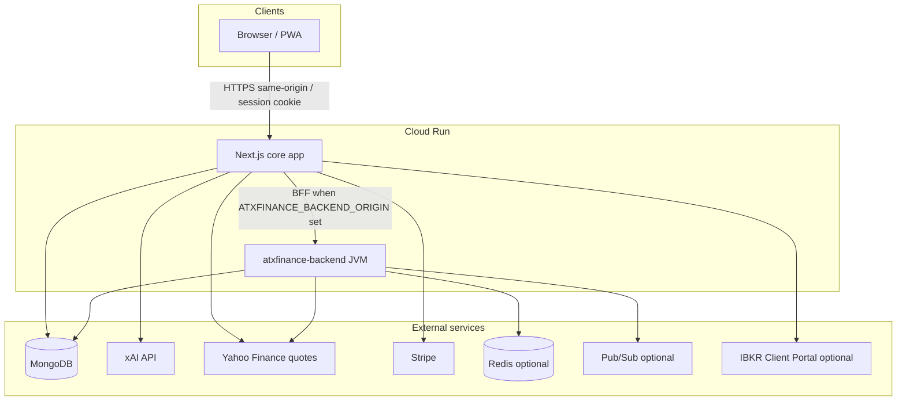

# xFinance monorepo — technical architecture & current state

Last updated: 2026-04-08  
App semver (canonical): root **`package.json`** (currently **3.3.19**; runtime label via `src/lib/app-version.ts` reads the same semver).

This file is the **single consolidated technical architecture** reference for the monorepo: runtime topology, responsibilities, shipped product surfaces, CI/test matrix, pre-production gates, and **known gaps**. Topic deep dives stay in linked **`atx-docs/*`** pages; **open backlog only** in [`PLAN.md`](../PLAN.md). **PR and production readiness** align with [`.cursor/agents/reviewer.md`](../../.cursor/agents/reviewer.md): contracts, OpenAPI parity, perf evidence on hot UI paths, Secret Manager / deploy docs when OAuth, BFF, or SMTP paths change, and **this doc** (or `PLAN.md`) when the shipped stack or consolidated gaps move.

---

## Technical architecture (consolidated)

**Production shape:** two primary deployables on **GCP Cloud Run** — the **Next.js** core app (UI + most `/api/*` route handlers + BFF) and **`atxfinance-backend`** (Kotlin/Spring worker with HTTP parity for migrated slices). Both share **one MongoDB** (tenant data, portfolios, personas, jobs, audit, xChat history when opted in). Optional **Redis** (strategy-job hourly caps, future cache), **Google Pub/Sub** (recommendation events when configured), **Stripe** (billing webhooks + Checkout on Next), and **xAI** (chat + management APIs from Next).



| Layer | Primary responsibilities |
|--------|---------------------------|
| **Next.js (App Router)** | Product UI; **edge** auth/guest gating in **`src/proxy.ts`**; signed session **`xf_core_session`**; **xChat** (`/api/xchat/*`) and xAI calls; **OpenAPI** inventory + admin Swagger; **Stripe** Checkout/webhooks/portal; **desk SMTP** for portfolio email and admin delivery-channel **Send test**; **BFF** forwarding per [`bff-proxy-routes.ts`](../../src/lib/bff-proxy-routes.ts) when **`ATXFINANCE_BACKEND_ORIGIN`** points at the Spring **HTTPS** origin |
| **Spring (`atxfinance-backend`)** | **ShedLock**-backed schedulers; **strategy jobs** orchestration + HTTP; Yahoo-backed **strategy-options** and related paths when proxied; admin/portfolio/RAG slices per **[`atxfinance-backend-http-api.md`](../sre-ops/atxfinance-backend-http-api.md)**; optional **recommendation** Pub/Sub publisher; **session** cookie parse aligned with Next |
| **MongoDB** | System of record: tenants, users, portfolios, watchlists, personas, **`strategy_jobs`**, **`options_strategy_preferences`**, **`admin_*`**, **`xchat_logs`** (when user opts in), IBKR consent rows, etc. |
| **Redis** | Optional: strategy-job rate cap when **`REDIS_URL`** set (see **[`spring-redis-memorystore.md`](../sre-ops/spring-redis-memorystore.md)**) |

**Auth (today):** Browser **X OAuth** flows live on **Next** (`/api/auth/x/*`); cutover toward Spring authority is **planned** with dual-run — see **[`api-consolidation-spring-backend.md`](../sre-ops/api-consolidation-spring-backend.md)** and **canonical live path table** in [`.cursor/plans/shared-context.md`](../../.cursor/plans/shared-context.md).

**BFF / consolidation:** Not every `/api/*` route is proxied. **Next-only** examples: **`/api/xchat/*`** (streaming/tools), tenant **`/api/admin/tasks*`** / scheduler tick, tenant **`/api/admin/delivery-channels*`** (desk SMTP on Next). Full migration board: **`api-consolidation-spring-backend.md`**.

**Market data:** Quotes and chains for product UX go through **Yahoo** adapters on Next (`yahoo-finance2`) and/or JVM Yahoo client on Spring for BFF paths — prefer **`market_quote` / `yahoo_finance`** tooling in xChat over narrative-only web fetches (**[`AGENTS.md`](../../AGENTS.md)**).

---

## Pre-production release gate (production deploy)

Before approving a **production** release, the **reviewer / operator** checklist (see **`reviewer.md` § Pre-production release gate**) is:

| # | Gate |
|---|------|
| **0** | **Version:** Root `package.json` / lockfile `packages[""].version` / `APP_VERSION` match the intended tag (e.g. **v3.3.19**). |
| **1** | **`npm run ci:gate`** green on the release ref: lint, typecheck, **`docs:links`** on all **`atx-docs/**/*.md`**, Vitest (unit + integration), OpenAPI parity (`tests/integration/openapi-*.test.ts`). |
| **2** | **`NODE_ENV=production npm run build`** succeeds (Next compile + static generation). |
| **3** | If **`services/atxfinance-backend/**` changed:** **`./gradlew test`** (from `services/atxfinance-backend`) green — do not ship prod with only Next green. |
| **4** | **Docs parity:** [`.cursor/skills/generate-docs/SKILL.md`](../../.cursor/skills/generate-docs/SKILL.md) for touched domains (API, BFF, xChat, strategy-options, OptionsStrategyEngine spec, `PLAN.md`, agents). |
| **5** | **Conscious test gaps** called out if shipping spec-only or partial coverage (no fake “done”). |
| **6** | No undisclosed schema / auth / API drift; OpenAPI tests still pass. |
| **7** | **[`.cursor/skills/test-commit-push/CHECKLIST.md`](../../.cursor/skills/test-commit-push/CHECKLIST.md)** — secrets, BFF registry, Mongo `tenant_portfolio`, staging-before-prod. |
| **8** | **Deploy:** GitHub Actions **Deploy Cloud Run** → environment **`production`**, required approvals; [`.cursor/skills/deploy-production/SKILL.md`](../../.cursor/skills/deploy-production/SKILL.md) + [`AGENTS.md`](../../AGENTS.md). |

---

## PR authors — merge hygiene (reviewer)

Authors should confirm in the PR (or thread) where relevant:

1. **Perf impact:** For **UI-heavy** changes, large dependencies, or **hot paths** (**xChat**, **xOptions**, **`/portfolios`**, **`/portfolio`**, route-level **`loading`** on those surfaces), attach **Lighthouse delta** and **React Profiler** screenshot or trace link — or state **N/A** with reason. **`ci:gate` alone** is not a substitute for that evidence when reviewer scope applies.
2. **This doc:** If the PR **materially** changes shipped stack, product surfaces, or a **Known gap** row below, update **`current-state-features.md`** or **`PLAN.md`** in the same PR (or link a tracked follow-up with owner).

Cross-check **[`.cursor/skills/test-commit-push/SKILL.md`](../../.cursor/skills/test-commit-push/SKILL.md)** for commit conventions and release-notes line when bumping semver ([`sre-ops/release-notes.md`](../sre-ops/release-notes.md)).

---

## Doc & roadmap index

| Topic | Where |
|--------|--------|
| **This doc (architecture + shipped state)** | *You are here* — [`current-state-features.md`](./current-state-features.md) |
| Backlog (open items only) | [`PLAN.md`](../PLAN.md) |
| IBKR integration (phases, compliance) | [`ibkr-automation.md`](./ibkr-automation.md) · module [`src/modules/ibkr-integration/README.md`](../../src/modules/ibkr-integration/README.md) |
| Next API inventory | [`guides/api-endpoints.md`](../guides/api-endpoints.md) |
| Spring HTTP contract | [`sre-ops/atxfinance-backend-http-api.md`](../sre-ops/atxfinance-backend-http-api.md) |
| BFF / consolidation | [`sre-ops/api-consolidation-spring-backend.md`](../sre-ops/api-consolidation-spring-backend.md) |
| Deploy, secrets, desk SMTP | [`guides/deploy-and-ops.md`](../guides/deploy-and-ops.md) |
| OptionsStrategyEngine (shipped scoring path) | [`xStrategyBuilder/strategy-engine.md`](./xStrategyBuilder/strategy-engine.md) |
| xOptions UI, find-options + strategy APIs | [`xchat/xoptions-strategy-builder.md`](../xchat/xoptions-strategy-builder.md) · [`guides/api-endpoints.md`](../guides/api-endpoints.md) § xOptions |
| OpenAPI inventory (admin Swagger) | `GET /api/openapi` · `src/lib/openapi/current-state.ts` (`CURRENT_STATE_ROUTES`) |
| Charts (Apex) | [`charts-apex.md`](./charts-apex.md) |
| Release history (semver, newest first) | [`sre-ops/release-notes.md`](../sre-ops/release-notes.md) |
| Reviewer / prod gate | [`.cursor/agents/reviewer.md`](../../.cursor/agents/reviewer.md) |
| Ship checklist (secrets, BFF) | [`.cursor/skills/test-commit-push/CHECKLIST.md`](../../.cursor/skills/test-commit-push/CHECKLIST.md) |
| Scheduled scanners (Phase 3 shipped) | [`scheduled-task/scanners-phase3-plan.md`](./scheduled-task/scanners-phase3-plan.md) |

---

## 1) Core app — Next.js (primary product)

- **Framework:** Next.js App Router (`src/app/*`)
- **Edge (Next 16):** Auth redirect / guest HTML gating lives in **`src/proxy.ts`** only (no `middleware.ts` — the framework allows one or the other). Matcher still covers protected app_user APIs and guest-capable HTML for **`/portfolio`**, **`/portfolios`**, **`/xoptions`** (see [`AGENTS.md`](../../AGENTS.md)).
- **UI:** React 19, TypeScript, Tailwind + **`--xf-*`** tokens from [`atxfinance-brand-kit.css`](./atxfinance-brand-kit.css)
- **Validation:** Zod; **`npm run typecheck`** (strict). **`tsconfig`** excludes **`.next/dev`** so stale dev-generated types do not break `tsc`; **`next-env.d.ts`** references **`.next/types/routes.d.ts`**. Route handlers must only export valid route symbols (shared serializers live under **`src/modules/*`**).
- **Data:** MongoDB via route handlers and `src/modules/*`; session cookie **`xf_core_session`**
- **API docs:** `GET /api/openapi` (inventory); admin **Swagger** at **`/admin/api-docs`**
- **CI gate:** **`npm run ci:gate`** → lint, typecheck, **`docs:links`** (all `atx-docs/**/*.md`), Vitest (unit + integration), OpenAPI parity tests (`tests/integration/openapi-*.test.ts`)
- **Optional BFF:** When **`ATXFINANCE_BACKEND_ORIGIN`** points at the **Spring** service **HTTPS** origin, selected **`/api/*`** routes proxy per [`bff-proxy-routes.ts`](../../src/lib/bff-proxy-routes.ts). **xChat** (`/api/xchat/*`) stays **Next-authoritative** (streaming not on Spring until explicitly migrated — see `PLAN.md` / `api-consolidation-spring-backend.md`).
- **Admin (`global_admin`, `/admin*`)** — Control Center (**`/admin`**): session + effective **tenant** ObjectId; **ops summary** (**`GET /api/admin/system/ops-summary`**) for Next Mongo/Redis + optional Spring **`/api/backend/health`**; personas, access, tasks, delivery channels, RAG inventory, and other hub routes.

### Product surfaces (app_user shell)

**Shell themes (soft vs deep):** See **[`shell-theme-guidelines.md`](./shell-theme-guidelines.md)** — contrast rules for all user-facing pages; Tailwind **`dark:`** aligns with deep shell in **`tailwind.config.ts`**.

Path prefixes for the shared product chrome are defined in **`APP_USER_PRODUCT_PATH_PREFIXES`** ([`surface-policy.ts`](../../src/modules/surface-policy.ts)): **`/xchat`**, **`/portfolio`**, **`/portfolios`**, **`/import-activity`**, **`/watchlist`**, **`/account`**, **`/workspace`**, **`/xoptions`**. Other user routes (e.g. **`/xcoach`**) exist but are not in that rail list unless extended there.

**Representative capabilities (non-exhaustive — see `api-endpoints.md`):**

- **xChat** — `POST /api/xchat/ask`, personas, plan limits; xAI-backed; history in Mongo (`xchat_logs` per product rules). **Vision paste (PNG / JPEG):** optional **`imageAttachment`** → xAI **`/v1/responses`** **`input_image`** (`detail: high`) + **`input_text`**; **same persona `model`** as text (or **`XAI_CHAT_MODEL`** fallback); optional **`XAI_VISION_MODEL`** overrides **image turns only**; multi-agent persona ids use default chat model on image turns. See [xAI image understanding](https://docs.x.ai/developers/model-capabilities/images/understanding).
- **Portfolio / accounts / holdings** — app_user and admin paths; workspace portfolio cookie; **`/portfolio/accounts/[id]`** Edit Account: consolidated holdings table (Last / Day Δ / Value / % acct / Qty / Avg cost) + add/remove lots — see **[`portfolio-edit-account-consolidated-holdings.md`](./portfolio-edit-account-consolidated-holdings.md)**. Merrill/Fidelity CSV import + **`/import-activity`** (broker ref **last-four** display; per-account **Use for import** toggles; copy in **`import-activity-copy.ts`**).
- **Watchlist** — user-scoped store, quotes, optional chain glance; desk columns / IV-OI highlights (see release notes **3.1.x**). **Price alerts** (Next-side scanner thresholds + cooldown): `src/modules/watchlist/price-alert-service.ts`; roadmap context in **`PLAN.md`** (**240n** shipped).
- **Portfolio alerts (desk)** — UI **`/portfolio/alerts`**; app_user **`GET` / `DELETE /api/portfolios/{portfolioId}/alerts`** (may BFF to Spring); global admin **`/api/admin/portfolios/{portfolioId}/alerts`** (+ `{alertId}` **PATCH** / **DELETE**). OpenAPI under **`portfolios`** / **`admin-portfolios`**.
- **xOptions** — strategy builder UI at **`/xoptions`** (step 4 **Choose contract**: heatmapped Vol/OI, Mid + spread hint, ATM pill, mobile Greeks toggle). Data plane is split across **find-options** (Next session APIs for bootstrap/context/holdings/watchlist/symbol snapshot), **strategy-options** (chain + expirations), and optional **Spring BFF** — see **Options stack** below.
- **xCoach** — learning surface (route present; detail in app).
- **Billing** — Stripe Checkout (`/account/billing`), webhooks → `subscriptionPlan` + **`stripeCustomerId`**, Customer Portal via `POST /api/billing/portal-session`; tier caps via `getPlanLimits()` (xChat, etc.). Ops: `stripe-billing-setup.md`.
- **IBKR (Client Portal, gated `IBKR_ENABLED`)** — consent (`ibkr_user_consents`), sealed httpOnly CP session + issued-at cookie; **`GET /api/integrations/ibkr/*`** including **`…/accounts/{id}/snapshot`** (summary, positions, orders, trades); account allowlist vs **`portfolio/accounts`**; **`[ibkr/audit]`** logs with **`correlationId`** matching response **`X-Correlation-Id`**; UI **`/account/integrations/ibkr`**. No in-app broker OAuth yet; no live order POST (see `ibkr-automation.md`).
- **Strategy jobs (hardcore)** — Next BFF to Spring: `POST/GET /api/strategy-jobs`, turns through **`slots_complete`**; Redis hourly cap when **`REDIS_URL`** set; contract in `atxfinance-backend-http-api.md` + smoke parity needles.

### Options stack (xOptions, chain, jobs, admin catalog) — reviewer map

| Layer | Role | Notes |
|--------|------|--------|
| **UI** | **`/xoptions`** | Stepped builder; workspace portfolio scope aligns with xChat/watchlist (`portfolioId` query + cookie). See [`xoptions-strategy-builder.md`](../xchat/xoptions-strategy-builder.md). |
| **Find-options** | Next session APIs | `GET /api/app-user/find-options/*` — **bootstrap** (one round-trip context + top holdings + hot watchlist), **context**, **symbol-snapshot**, **top-holdings**, **watchlist-hot**; **`/api/app-user/symbol-chart`**. OpenAPI tag **`find-options`**. |
| **Market pulse** | Next | `GET /api/market/workspace-pulse` (nearest-expiry options highlight-style summary for workspace UX); `GET /api/market/symbol-quotes`. Tag **`market`**. |
| **Strategy-options** | Next + optional Spring | `GET /api/strategy-options/expirations` — **always** Next Yahoo (avoids JVM stalls in dev/prod). `GET /api/strategy-options` — may **BFF-proxy** to Spring; on sparse chain or bad JSON, Next falls back to Yahoo (`src/app/api/strategy-options/route.ts`). |
| **Strategy jobs** | Spring orchestrator, Next BFF | Same paths on the Next host (`/api/strategy-jobs*`) forward to Kotlin when **`ATXFINANCE_BACKEND_ORIGIN`** is set; **503** with hint when JVM unreachable in dev. Mongo **`strategy_jobs`**; finalizer uses **`XAI_API_KEY`**. OpenAPI tag **`strategy-jobs`**. |
| **Admin options-strategy** | Next only | `GET|POST /api/admin/options-strategy`, `GET|PATCH|DELETE …/{strategyId}`, preferences `…/options-strategy-preferences*`. **Not** on Spring HTTP surface. Mongo **`options_strategy_preferences`** seeded from disk (`atx-docs/rag-collection/options-strategy/**`, `npm run seed:options-strategy-prefs`). OpenAPI tag **`admin-options-strategy`**. |
| **Engine / scanners** | Kotlin **`strategy`** package | **`OptionsStrategyEngine`** scoring + scheduled **options_scanner** (and related Phase 3 tasks) — canonical flow in [`xStrategyBuilder/strategy-engine.md`](./xStrategyBuilder/strategy-engine.md); tenant tasks in [`scheduled-task/scanners-phase3-plan.md`](./scheduled-task/scanners-phase3-plan.md). |
| **RAG / personas** | xChat | Persona collection scope may include slug **`options-strategy`** (`GET /api/personas/collections`) for KB-aligned prompts; distinct from Mongo **`options_strategy_preferences`** admin catalog. |

**Contract sources:** [`guides/api-endpoints.md`](../guides/api-endpoints.md) (grouped list), **`GET /api/openapi`** + **`/admin/api-docs`**, [`sre-ops/atxfinance-backend-http-api.md`](../sre-ops/atxfinance-backend-http-api.md) (Spring paths including **`/api/strategy-options`** and **`/api/strategy-jobs*`**), [`sre-ops/api-consolidation-spring-backend.md`](../sre-ops/api-consolidation-spring-backend.md) (BFF registry).

### Quick pointers

- Implementation: **`src/app/`**, **`src/modules/`**
- Local dev: [`guides/local-development.md`](../guides/local-development.md)
- AGENTS runbook: [`AGENTS.md`](../../AGENTS.md)

---

## 2) Worker / API — `atxfinance-backend` (Kotlin/Spring)

Scope: scheduler/worker and **thin HTTP API** for portfolio/admin/strategy/RAG-support paths. Built from **`services/atxfinance-backend`** (repo-root Dockerfile can build this JAR).

- **Runtime:** Kotlin, Spring Boot, **JDK 21**
- **Build:** Gradle (`build.gradle.kts`); **`npm run build:backend`** runs **`./gradlew test`**
- **Data:** MongoDB (Spring Data Mongo)
- **Scheduling:** `@Scheduled` + **ShedLock** (Mongo lock collection)
- **Messaging:** Google **Pub/Sub** publisher when configured — **subscriber/consumer not implemented** (platform follow-on)
- **Observability:** Micrometer (GMP-oriented) + OTLP optional
- **HTTP:** REST (health, portfolio, admin, strategy, RAG, auth callback stubs); SpringDoc **2.x** — **`/swagger-ui.html`**

### Boot & configuration

- Entry: `com.atxfinance.backend.Application`
- Config: `AtxfinanceProperties` (`app.atxfinance.*`)
- Mongo: `MONGODB_URI` / `MONGODB_URI_B64` early resolution → `spring.data.mongodb.uri`
- Pub/Sub: `app.pubsub.project-id`, `app.pubsub.topic`, `app.pubsub.dlq-topic`

### Module map (packages)

- **`config/`** — properties, Mongo URI, ShedLock, executors
- **`web/`** — REST controllers
- **`portfolio/`**, **`admin/`** — CRUD, watchlist, positions, **platform `admin_delivery_channels`** (`in_app` \| `slack` \| **`email`**), tenant tasks, deploy notes
- **`audit/`** — audit writers + admin query
- **`strategy/`** — strategy jobs HTTP handlers, Yahoo client, **`OptionsStrategyEngine`** (scoring + **`options_scanner`** / scanner job alignment — see `strategy-engine.md` and `scanners-phase3-plan.md`)
- **`rag/`** — ingestion helpers, xAI collection clients
- **`session/`** — session cookie parse (name aligns with Next: **`xf_core_session`**)
- **`notify/`** — Slack, **desk SMTP** (`DeskSmtpSender`) for proxied admin test-send (parity with Next `desk-smtp.ts`)

### Notable Mongo collections (Spring + shared)

Centralized in `AtxfinanceProperties`. Examples: **`tenant_portfolio`**, **`portfolio_accounts`**, **`portfolio_positions`**, **`portfolio_watchlists`**, **`strategy_jobs`**, **`options_strategy_preferences`** (admin catalog + seed; Next CRUD), **`xchat_personas`**, **`core_users`**, **`admin_audit_events`**, **`admin_scheduled_tasks`**, **`admin_delivery_channels`**, **`app_user_recommendations`**, RAG (`xai_collections`, `xchat_rag_chunks`, `xchat_logs`), etc.

### HTTP (selected)

- **Health:** `GET /actuator/health`, `GET /api/health`, `GET /api/backend/health`
- **Portfolio (session):** `GET|PATCH /api/portfolios/{portfolioId}` (and nested resources per `web/`)
- **Admin / app:** access requests, audit, broker import, recommendations, strategy, RAG — full list in **`atxfinance-backend-http-api.md`**

### Scheduling & deployment baseline

- ShedLock default max lock **PT5M**; scheduler thread pool (e.g. core/max 4)
- **Cloud Run (typical):** concurrency **1**, **1 vCPU**, **1 GiB**, HTTP **:8080**

### Run locally

```bash
cd services/atxfinance-backend
./gradlew bootRun   # env from repo-root .env as needed
```

Service README: [`services/atxfinance-backend/README.md`](../../services/atxfinance-backend/README.md)

---

## 3) Desk email (Next + Spring)

When SMTP + **`DESK_EMAIL_FROM`** are configured (see **`.env.example`** / `src/lib/env.ts`):

- **Next** — portfolio desk channels, price-alert paths, admin **`POST /api/admin/delivery-channels/{id}/test`** (`src/lib/desk-smtp.ts`). Optional test-only env: **`DESK_DELIVERY_CHANNEL_TEST_TO`**, **`DESK_DELIVERY_CHANNEL_TEST_SUBJECT`** — [`deploy-and-ops.md`](../guides/deploy-and-ops.md).
- **Spring** — **`DeskSmtpSender`** + **`AdminDeliveryChannelsService`** exist for HTTP parity / direct JVM use; tenant delivery-channel routes from the **Next app are not BFF-proxied** (always `src/lib/desk-smtp.ts` for **Send test** in product).
- **Ops:** Bind desk-SMTP secrets on the **Next** Cloud Run service for admin delivery tests and portfolio email; [`deploy-and-ops.md`](../guides/deploy-and-ops.md). UI: **`/admin/delivery-channels`**.

---

## 4) Testing matrix (what runs in CI vs optional)

| Layer | Command / location | Notes |
|--------|-------------------|--------|
| **Next gate** | **`npm run ci:gate`** | lint + typecheck + **markdown link check** + full Vitest suite + OpenAPI inventory tests |
| **Vitest unit** | `tests/unit/**` | Fast, mocked deps |
| **Vitest integration** | `tests/integration/**` | Route/module tests; **no** live Mongo required for default suite |
| **OpenAPI parity** | `tests/integration/openapi-*.test.ts` | **`CURRENT_STATE_ROUTES`** must match implemented routes |
| **Smoke** | `tests/smoke/**`, `npm run smoke:*` | Backend HTTP parity needles, optional live smokes (skipped unless env flags) |
| **Spring** | **`./gradlew test`** in `services/atxfinance-backend` | Required before prod when Kotlin changes; **`npm run build:backend`** in CI stack |
| **Live stack** | **`npm run test:integration:live`** | Docker Compose + Mongo + backend + Redis — opt-in |

---

## 5) Known gaps — tests & docs (reviewer-style, consolidated)

These are **documented** backlog items or **conscious** holes; do not treat as shipped.

| Gap | Pointer |
|-----|---------|
| **xChat on Spring + BFF streaming** | `PLAN.md` · `api-consolidation-spring-backend.md` |
| **Strict JSON Schema artifact v2** (strategy jobs) | `PLAN.md` · `atx-multi-agent.md` |
| **`POST /api/import/broker/clean`** — no dedicated integration test (destructive) | `PLAN.md` § test/doc follow-ups · `api-endpoints.md` |
| **Admin `PATCH/DELETE …/positions/{id}`** — Next until BFF registry + Kotlin parity | `PLAN.md` |
| **Pub/Sub consumer** on Spring | This doc §2 · `PLAN.md` / release notes |
| **IBKR** — no broker OAuth/token refresh in-app; no order placement | `ibkr-automation.md` |
| **Plan limits UI** — usage meter / soft-limit banner on xChat from `getPlanLimits()` | `PLAN.md` (deferred) · branding TODO in `AGENTS.md` |
| **xChat** — vision paste **shipped** (follow-ups: scan/EXIF/dims/batch — `PLAN.md` deferred); voice (703), xMoney billing (704) | `PLAN.md`; **701** privacy history **shipped** (see `PLAN.md` deferred shipped list + `xchat-history-storage.md`) |
| **OptionsStrategyEngine** — extend scoring / desk notification providers | `PLAN.md` · `reviewer.md` §245 |
| **Lighthouse / perf in default CI** | **`npm run ci:gate`** does **not** run Lighthouse; hot-path PRs attach local LHCI or manual Lighthouse per **`reviewer.md`**; optional repo **`.lighthouseci/`** config for local regression |

**Governance:** Tenant workspace limits, persona changes, and SMTP/BFF/deploy workflow edits should update **`CURRENT_STATE_ROUTES`**, relevant **`atx-docs/guides/*`**, and **`tests/unit/surface-policy.test.ts`** when **`APP_USER_PRODUCT_PATH_PREFIXES`** or public contracts change.

---

### UX performance (baseline & release prep)

- **Targets (product):** LCP ≤ 2.0 s, INP ≤ 200 ms, CLS ≤ 0.1 on **`/portfolio`**, **`/portfolios`**, **`/xoptions`**, **`/watchlist`**, **`/xchat`** where feasible.
- **Post-deploy smoke:** **`GET /api/health`** (version matches image); app_user / admin paths per [`AGENTS.md`](../../AGENTS.md) § Production validation.
- **High-risk clients:** ApexCharts (xOptions symbol panel), long xChat threads, watchlist quote refresh, IBKR snapshot panels, virtualized portfolio tables.
- **Local regression:** Teams may run **Lighthouse CI** (e.g. **`.lighthouseci/config.cjs`**) against **`127.0.0.1:3000`** for `/xchat`, `/portfolio`, `/portfolios` — **not** a merge blocker unless workflow is added to GitHub Actions.
- **Recent LHCI direction:** improve performance scores on **`/xchat`** and **`/portfolios`** (history + virtualized lists); keep INP ≤ 200 ms on interactive surfaces.

---

## References (unchanged deep dives)

- `services/atxfinance-backend/README.md`
- `atx-docs/sre-ops/atxfinance-backend-http-api.md`
- `atx-docs/PLAN.md`
- `atx-docs/guides/deploy-and-ops.md`
- Kotlin sources: `services/atxfinance-backend/src/main/kotlin/com/atxfinance/backend/**`
