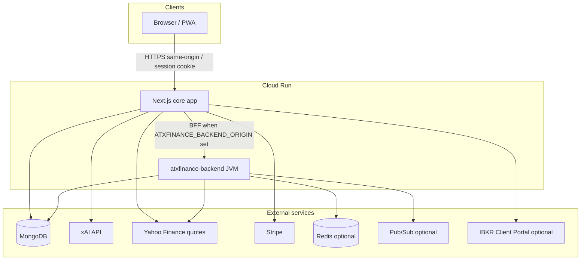

# xFinance monorepo — technical architecture & current state

Last updated: 2026-05-22  
App semver (canonical): root **`package.json`** (currently **3.20.3**; runtime label via `src/lib/app-version.ts` → **`APP_VERSION`** reads the same semver).

This file is the **single consolidated technical architecture** reference: runtime topology, responsibilities, product surface map (what exists in repo today), CI/test matrix, pre-production gates, **known gaps**, and **baseline contracts** teams must not regress without review. Topic deep dives stay in linked **`atx-docs/*`** pages; **prioritized next work** lives in [`PLAN.md`](../PLAN.md). **Directional themes** (summary under [What's next (engineering)](#whats-next-engineering) below): **xChat harden**, **engine × xAI** conversational layer (tools + **InvestmentOutlook**), **Monte Carlo tail-risk** companion to **`OptionsStrategyEngine`**, **portfolio / multi-book outlook** schema & services, and **scheduling / observability / backtest** harness — full tables and priority IDs in **`PLAN.md`**. **PR and production readiness** align with [`.cursor/agents/reviewer.md`](../../.cursor/agents/reviewer.md): contracts, OpenAPI parity, perf evidence on hot UI paths, Secret Manager / deploy docs when OAuth, BFF, or SMTP paths change — update **this doc** when architecture or baseline contracts change.

---

## Tech stack quick reference (canonical)

Values below track **`package.json`** and **`services/atxfinance-backend/gradle/libs.versions.toml`** / **`build.gradle.kts`**.

| Layer | Stack |
|--------|--------|
| **Frontend (core app)** | **Next.js 16.x** (App Router), **React 19.2.x**, **TypeScript 5.9.x**, **Tailwind CSS 3.4.x**, **ESLint 9.x** + `eslint-config-next` |
| **UI / data viz** | **ApexCharts 5.x** + `react-apexcharts`, **Framer Motion**, **TanStack React Virtual**, **react-markdown** + **rehype-sanitize** / **remark-gfm**, **Workspace Starfield** (`src/app/ui/starfield-background.tsx`) — full-bleed fixed layer (`z-index: -20`) on `/xchat`, `/xoptions`, `/portfolios`, under header/footer/rail, with theme-aware base fill, subtle center radial depth, 1px grid, low-density node/line constellation animation (CSS-only, reduced-motion safe), and static Austin skyline anchor (`/branding/atx-skyline-light.png`) at the lower viewport band. |
| **Next runtime libs** | **MongoDB** Node driver **7.x**, **Zod 4.x**, **Stripe** SDK **17.x**, **yahoo-finance2** **3.14.x** (batch/single quote paths use **`yahooQuoteWithValidationFallback`** when schema validation fails), **nodemailer** **8.x** (desk SMTP + credential-invite / reset mail), optional **redis** client **4.x**, **@google-cloud/pubsub** **4.x**, **yaml**, **cronstrue** / **rrule** |
| **API docs (Next)** | **swagger-ui-react** / **swagger-ui-dist** **5.32.x** — admin **`/admin/api-docs`** backed by **`GET /api/openapi`** |
| **Tests (Next)** | **Vitest 3.2.x**, **tsx**; integration + OpenAPI parity under **`tests/integration/**`** |
| **Backend worker** | **Spring Boot 3.3.4**, **Kotlin 1.9.25**, **JDK 21**; **Spring Data MongoDB** + **Redis** starters; **SpringDoc OpenAPI 2.6.x** (**`/swagger-ui.html`**); **ShedLock 5.13.x** (Mongo provider); **Micrometer** + **OTLP** optional; **Angus Mail** (desk SMTP parity); tests use **embedded Mongo** |
| **Deploy / data plane** | **GCP Cloud Run** (two services: Next + JVM); **MongoDB** (shared); optional **Redis** (e.g. Memorystore); **GCP Secret Manager**; optional **Google Pub/Sub** |

---

## Technical architecture (consolidated)

**Production shape:** two primary deployables on **GCP Cloud Run** — the **Next.js** core app (UI + most `/api/*` route handlers + BFF) and **`atxfinance-backend`** (Kotlin/Spring worker with HTTP parity for migrated slices). Both share **one MongoDB** (tenant data, portfolios, personas, jobs, audit, xChat history when opted in). Optional **Redis** (strategy-job hourly caps, future cache), **Google Pub/Sub** (recommendation events when configured), **Stripe** (billing webhooks + Checkout on Next), and **xAI** (chat + management APIs from Next).

**Cloud Run prod sizing (operator baseline):** **Next** — 1 vCPU, 1Gi, concurrency 100, min 1 / max 12, CPU boost on; **Spring** — 1 vCPU, 1Gi, concurrency 80, min 1 / max 8, CPU boost on (Redis-budget profile). Tables + `gcloud` examples: **`atx-docs/sre-ops/gcp-prod-two-service-model.md`**.



| Layer | Primary responsibilities |
|--------|---------------------------|
| **Next.js (App Router)** | Product UI; **edge** auth/guest gating in **`src/proxy.ts`**; signed session **`xf_core_session`**; **xChat** (`/api/xchat/*`) + xAI **Responses** tool-loop (**optional live token SSE** on **`POST /api/xchat/ask`** when `Accept: text/event-stream`, **`POST /api/xchat/ask/stream`**, UI gated by **`NEXT_PUBLIC_XCHAT_LIVE_SSE`**); **Rental AI** (`/api/ai/rent/*`) — Bearer keys on **`core_tenants.apiKeys`**, **`POST /chat`** (JSON + SSE) via xChat tool-loop, **`strategy`** / **`analyze`** **`POST`→202** + **`GET`** poll (**`rental_ai_jobs`**), token metering + **`x-rental-tokens-*`** headers — **`atx-docs/sre-ops/rental-ai-platform.md`**; **OpenAPI** inventory (**`current-state.ts`** + **`current-state-overrides.ts`**) + admin Swagger; **Stripe** Checkout/webhooks/portal; **desk SMTP** (`nodemailer`) for portfolio email, admin delivery-channel **Send test**, **credential-invite / password-reset** mail (**≥3.12.7:** admin **`POST /api/admin/users/{userId}/resend-credential-invite`** + Manage users **Resend invite**); **BFF** forwarding per [`bff-proxy-routes.ts`](../../src/lib/bff-proxy-routes.ts) when **`ATXFINANCE_BACKEND_ORIGIN`** points at the Spring **HTTPS** origin |
| **Spring (`atxfinance-backend`)** | **ShedLock**-backed schedulers; **strategy jobs** orchestration + HTTP; Yahoo-backed **strategy-options** and related paths when proxied; admin/portfolio/RAG slices per **[`atxfinance-backend-http-api.md`](../sre-ops/atxfinance-backend-http-api.md)**; optional **recommendation** Pub/Sub publisher; **session** cookie parse aligned with Next; **`CredentialInviteService`** when BFF proxies access-request **approve** (Mongo invite fields + **DeskSmtpSender**) |
| **MongoDB** | System of record: tenants (**optional `rentalProfile` / **`apiKeys`** / `rentalExpiresAt`** for white-label rental API), users, portfolios, watchlists, personas, **`strategy_jobs`**, **`options_strategy_preferences`**, **`admin_*`**, **`xchat_logs`** (when user opts in), **`xchat_usage_limits`** (per-user minute / optional UTC hour / UTC day counters for `POST /api/xchat/ask` plus **`rentalTokensUsed`** buckets for rental metering), **`rental_ai_token_usage`**, **`rental_ai_jobs`**, IBKR consent rows, etc. |
| **Redis** | Optional: strategy-job rate cap when **`REDIS_URL`** set; JVM **`GET /api/portfolios/{portfolioId}/snapshot`** is the **canonical fast-path** for hot reads of materialized workspace preload (**`xf:wsnap:v1:*`**, same keys as Next) with market-window TTL and **`data.structured`** for holdings/balances/watchlist quote strip. Next **`loadWorkspaceSnapshotPreload`** / **`GET /api/app-user/find-options/bootstrap`** call JVM after local Redis miss when **`ATXFINANCE_BACKEND_ORIGIN`** is set; unset origin ⇒ Mongo materialization + Next Redis only — see **[`spring-redis-memorystore.md`](../sre-ops/spring-redis-memorystore.md)** |

**Auth (today):** **X (Twitter) OAuth** on **Next** (`/api/auth/x/*`). **Sign in with Google** is **optional** when `GOOGLE_CLIENT_ID` / `GOOGLE_CLIENT_SECRET` are set (`/api/auth/google/*`, see **`src/lib/env.ts`** / **`isGoogleOAuthConfigured`**). **Email + password** (**app ≥3.6.17**): `POST /api/auth/email/login`, **complete-invite** / **forgot-password** / **reset-password**; `core_users.passwordHash` (scrypt), invite/reset token hashes; sessions without **`xUserId`** when email-only; **`/login`** surfaces OAuth-first + email form (`src/app/login/`). Post-approve invite email: **Next** handler orders invite before xAI bootstrap; **Spring** **`CredentialInviteService`** when admin approve is BFF-proxied — **`PUBLIC_APP_BASE_URL`** + SMTP on the sending service. Cutover toward Spring as authority is **planned** with dual-run — **[`api-consolidation-spring-backend.md`](../sre-ops/api-consolidation-spring-backend.md)** and **canonical live path table** in [`.cursor/plans/shared-context.md`](../../.cursor/plans/shared-context.md).

**Edge session grounding (≥3.17.5):** **`src/proxy.ts`** calls **`GET /api/internal/authz/session-grounding`** for matcher paths with a session cookie (**default** **`SESSION_EDGE_GROUNDING`** on); verifies **`core_users`** approval gate + **`core_tenant_memberships`** for **`session.tenantId`** (**`resolveTenantMembershipForSessionGrounding`** — legacy-safe tenant id normalization). Matcher includes **`/api/personas`** (bare + **`/:path*`**). **≥3.17.6:** fail-open on internal **`fetch`** errors / **5xx**/**429** so refresh does not wipe valid sessions; explicit grounding **401** still denies — **`auth-and-access.md`** § Edge session grounding.

### Shipped — BFF migration (incremental)

Hot-path **Next → Spring** BFF is **shipped** when **`ATXFINANCE_BACKEND_ORIGIN`** is set — canonical registry **[`bff-proxy-routes.ts`](../../src/lib/bff-proxy-routes.ts)** and narrative **[`api-consolidation-spring-backend.md`](../sre-ops/api-consolidation-spring-backend.md)**. Includes (non-exhaustive): portfolios / positions / watchlist where registered, **admin scheduled tasks** (`/api/admin/tasks*`, **`GET /api/admin/task-runs`**, **`POST /api/admin/scheduler/tick`**) when the admin BFF gate is on, strategy-jobs, read facade **`GET /api/read/product-shell-v1`**, xChat **`POST /api/xchat/ask/stream`** (ops opt-out **`XCHAT_SSE_PROXY_BACKEND`** → Next-only SSE), workspace JVM snapshot, **admin delivery-channels** when the admin gate is on, **app-user desk alert create** **`POST /api/portfolios/{portfolioId}/alerts`** (Mongo row on JVM; **GET**/**DELETE** list/bulk clear and Next-local desk fan-out on create stay on Next). **Next-authoritative** for core JSON ask: **`POST /api/xchat/ask`** (**`/v1/responses`** tool-loop + optional in-process SSE) — **`xchat-tools-guide.md`** / **`xchat-history-storage.md`** / **`XCHAT_USE_REMOTE_HISTORY`**.

**BFF / consolidation — remainder:** Not every `/api/*` route is proxied; route-level parity gaps stay in **Known gaps** below and **`PLAN.md`**. Full migration board: **`api-consolidation-spring-backend.md`**.

**Market data:** Quotes and chains for product UX go through **Yahoo** adapters on Next (`yahoo-finance2`) and/or JVM Yahoo client on Spring for BFF paths — prefer **`market_quote` / `yahoo_finance`** tooling in xChat over narrative-only web fetches (**[`AGENTS.md`](../../AGENTS.md)**).

---

## Tenant UX (`tenant_ux`) — white-label navigation & enforcement

**Purpose:** Per-tenant **platform role** route allowlists + default landing paths for app users; **display-only** branding (names, accent, logo URL, tagline, `xf_ui_theme` default) via `core_tenants.tenantPreferences` — **not** a different regulatory story per tenant.

| Area | Notes |
|------|-------|
| **Provisioning / bootstrap** | **`ensureTenantBootstrapForUser`** (login + optional approve-time when **`bootstrap_on_approve`**); structured **`bootstrap_policy`** per role; **`watchlist_seed_symbols`** + desk defaults; **`seed:tenant`** + **`tenant-specs/*.yaml`** (**`tenant.bootstrapPolicy`**, **`tenant.bootstrapOnApprove`**). See **`auth-and-access.md`** § Admin approval → default book. |
| **Catalog + drift tests** | `data/platform/app-user-route-catalog.json`, `getAppUserRouteCatalog()`, `assertCatalogMatchesWorkspaceProductPrefixes()` |
| **Admin read/write** | `GET /api/admin/platform/route-catalog`, `GET/PATCH /api/admin/platform/route-catalog/{tenantId}` (PATCH emits **`admin_audit_events`** `tenant_ux.route_catalog.patch`); optional overrides in `tenantPreferences` |
| **Role matrix** | `GET/PUT /api/admin/tenants/{tenantId}/roles`, `PATCH .../roles/{role}`; UI `/admin/tenants/{tenantId}/roles`; **`PUT` writes** `tenant_roles` + audit |
| **Runtime** | Resolver + `tenant-ux-policy-cache`; page guards; workspace rail / key headers; `GET /api/app-user/me/role`; **`/access-denied`** |
| **Edge V2** | `src/proxy.ts` — when **`TENANT_UX_ENFORCEMENT_V2`** is true, calls `GET /api/internal/tenant-ux/policy`; denials → **403** `tenant_ux_route_forbidden` (API) or `/access-denied` (HTML); optional **`TENANT_UX_POLICY_FAIL_CLOSED`** → **503** `tenant_ux_policy_unavailable` on resolver fetch failures (default remains fail-open with structured log `tenant_ux_policy_fetch_error`) |
| **Policy path map** | `src/modules/platform/tenant-ux-proxy-policy-path.ts` — `resolvePolicyPathForRequest` (includes **`/xcoach`** as product prefix); proxy matcher includes **`/xcoach`** |
| **xChat branding context** | System prompt + approved-shell welcome line include **tenant desk label** (`formatTenantWorkspaceContextBlockForXchat`); fingerprint includes tenant block for remote history |
| **CSS tokens** | `--xf-tenant-primary` / `--xf-tenant-secondary` in **`atxfinance-brand-kit.css`**; `layout` + **`TenantBrandingProvider`** set accent-derived vars |

**Soak / backlog:** Staging-first **48–72h** V2 rollout before prod (**`.env.example`** soak note); **policy cache:** proxy memory TTL **+ Redis** (**`tenant-ux:policy:v2:*`**, **60s**) with **explicit bust** on role/catalog mutations; **PWA:** dynamic **`src/app/manifest.ts`** at **`/manifest.webmanifest`** (tenant branding when signed in); nav/header parity beyond workspace rail; **GCP** log/metric filters + alerts for stderr **`tenant_ux_*`** lines (optional Mongo **`tenant_ux_observability_events`** via admin API). Runbook: **`atx-docs/sre-ops/tenant-ux-enforcement.md`** · **`atx-docs/sre-ops/redis-cache-next.md`** § Tenant UX policy.

---

## Pre-production release gate (production deploy)

Before approving a **production** release, the **reviewer / operator** checklist (see **`reviewer.md` § Pre-production release gate**) is:

| # | Gate |
|---|------|
| **0** | **Version:** Root `package.json` / `APP_VERSION` match the intended tag (e.g. **v3.6.0**). |
| **1** | **`npm run ci:gate`** green on the release ref: lint, typecheck, **`docs:links`** on all **`atx-docs/**/*.md`**, Vitest (unit + integration), OpenAPI parity (`tests/integration/openapi-*.test.ts`). |
| **2** | **`NODE_ENV=production npm run build`** succeeds (Next compile + static generation). |
| **3** | If **`services/atxfinance-backend/**` changed:** **`./gradlew test`** (from `services/atxfinance-backend`) green — do not ship prod with only Next green. |
| **4** | **Docs parity:** [`.cursor/skills/test-commit-push/SKILL.md`](../../.cursor/skills/test-commit-push/SKILL.md) + [`.cursor/agents/reviewer.md`](../../.cursor/agents/reviewer.md) for touched domains (API, BFF, xChat, strategy-options, OptionsStrategyEngine spec, `PLAN.md`, agents). |
| **5** | **Conscious test gaps** called out if shipping spec-only or partial coverage (no fake “done”). |
| **6** | No undisclosed schema / auth / API drift; OpenAPI tests still pass. |
| **7** | **[`.cursor/skills/test-commit-push/CHECKLIST.md`](../../.cursor/skills/test-commit-push/CHECKLIST.md)** — secrets, BFF registry, Mongo `tenant_portfolio`, staging-before-prod. |
| **8** | **Deploy:** GitHub Actions **Deploy Cloud Run** → environment **`production`**, required approvals; [`.cursor/skills/deploy-production/SKILL.md`](../../.cursor/skills/deploy-production/SKILL.md) + [`AGENTS.md`](../../AGENTS.md). |

---

## PR authors — merge hygiene (reviewer)

Authors should confirm in the PR (or thread) where relevant:

1. **Perf impact:** For **UI-heavy** changes, large dependencies, or **hot paths** (**xChat**, **xOptions**, **`/portfolios`**, **`/portfolio`**, route-level **`loading`** on those surfaces), attach **Lighthouse delta** and **React Profiler** screenshot or trace link — or state **N/A** with reason. **`ci:gate` alone** is not a substitute for that evidence when reviewer scope applies.
2. **This doc:** If the PR **materially** changes runtime topology, product surfaces, **baseline contracts**, or a **Known gap** row below, update **`current-state-features.md`** or **`PLAN.md`** in the same PR (or link a tracked follow-up with owner).

Cross-check **[`.cursor/skills/test-commit-push/SKILL.md`](../../.cursor/skills/test-commit-push/SKILL.md)** for commit conventions and release-notes line when bumping semver ([`sre-ops/release-notes.md`](../sre-ops/release-notes.md)).

---

## Doc & roadmap index

| Topic | Where |
|--------|--------|
| **This doc (architecture + baselines + gaps)** | *You are here* — [`current-state-features.md`](./current-state-features.md) |
| **Product & GTM (xChat, xOptions)** | [`product/xchat-product-brief.md`](../product/xchat-product-brief.md) · [`product/xoptions-product-brief.md`](../product/xoptions-product-brief.md) |
| **What to build next** | [`PLAN.md`](../PLAN.md) |
| IBKR integration (phases, compliance) | [`ibkr-automation.md`](./ibkr-automation.md) · module [`src/modules/ibkr-integration/README.md`](../../src/modules/ibkr-integration/README.md) |
| Next API inventory | [`guides/api-endpoints.md`](../guides/api-endpoints.md) |
| Spring HTTP contract | [`sre-ops/atxfinance-backend-http-api.md`](../sre-ops/atxfinance-backend-http-api.md) |
| BFF / consolidation | [`sre-ops/api-consolidation-spring-backend.md`](../sre-ops/api-consolidation-spring-backend.md) |
| Deploy, secrets, desk SMTP | [`guides/deploy-and-ops.md`](../guides/deploy-and-ops.md) |
| Tenant workspace limits (xChat day/hour, xOptions copy, plan overrides) | [`sre-ops/tenant-workspace-limits.md`](../sre-ops/tenant-workspace-limits.md) |
| OptionsStrategyEngine (scoring path) | [`xoptions/strategy-engine.md`](./xoptions/strategy-engine.md) (engine + fit-score contract) |
| xOptions UI, find-options + strategy APIs | [`xoptions/product-ux-spec.md`](./xoptions/product-ux-spec.md) · [`product/xoptions-product-brief.md`](../product/xoptions-product-brief.md) · [`guides/api-endpoints.md`](../guides/api-endpoints.md) § xOptions |
| OpenAPI inventory (admin Swagger) | `GET /api/openapi` · `src/lib/openapi/current-state.ts` (`CURRENT_STATE_ROUTES`) |
| Charts (Apex) | [`charts-apex.md`](./charts-apex.md) |
| Release history (semver, newest first) | [`sre-ops/release-notes.md`](../sre-ops/release-notes.md) |
| Reviewer / prod gate | [`.cursor/agents/reviewer.md`](../../.cursor/agents/reviewer.md) |
| Ship checklist (secrets, BFF) | [`.cursor/skills/test-commit-push/CHECKLIST.md`](../../.cursor/skills/test-commit-push/CHECKLIST.md) |
| Scheduled scanners (Phase 3) | [`scheduled-task/scanners-phase3-plan.md`](./scheduled-task/scanners-phase3-plan.md) |
| Tenant workspace automations (`ownerKind: tenant_user`) | [`scheduled-task/user-tasks.md`](./scheduled-task/user-tasks.md) |

### What's next (engineering)

Prioritized backlog — detail and IDs in [`PLAN.md`](../PLAN.md). **Priority tracks:** **707** xChat harden · **708** Monte Carlo tail-risk (see table there). **Pillars** (deep specs): [xChat harden](../PLAN.md#xchat-harden) · [Engine × xAI](../PLAN.md#engine-xai-conversational-layer) · [Monte Carlo tail-risk](../PLAN.md#monte-carlo-tail-risk) · [Portfolio schema & outlook](../PLAN.md#portfolio-schema-multi-book-outlook) · [Scheduling / market data / compliance harness](../PLAN.md#scheduling-market-data-compliance-harness).

| Theme | Next moves |
| --- | --- |
| **Tenant & access** | **`tenant_ux` V2** field validation (**May 2026**): global admin, tenant admin, and app_user soak passed — removed from [`PLAN.md`](../PLAN.md) priority table; optional ops metrics/alerts in [tenant-ux-enforcement.md](../sre-ops/tenant-ux-enforcement.md). Multi-tenant provisioning UX + Spring book parity (**PLAN 10**). |
| **Monetization / platforms** | Rental AI billing + admin key UX (**PLAN 41**); **xMoney** parallel checkout + crypto book phases (**PLAN 704**); Stripe usage-meter gaps (billing §). |
| **Execution & data** | IBKR CP refresh + paper harness → sync → orders (**PLAN 200**); automated verified trades only after custodian path (**PLAN 900**). |
| **Automation** | User tasks → strategy / scan handoff (**PLAN 705**); tenant automations NL schedule + fairness (**PLAN 706**). |
| **xChat & engine-grounded advisory** | **PLAN 707** — **[xChat harden](../PLAN.md#xchat-harden)** (engine-grounded tools, vision policy, metering, optional JVM-authoritative ask, artifacts/schema parity, TEAM KB). **PLAN 708** — **[Monte Carlo tail-risk](../PLAN.md#monte-carlo-tail-risk)** (VaR/CVaR, tier gates; companion to [`OptionsStrategyEngine`](./xoptions/strategy-engine.md)). **[Engine × xAI](../PLAN.md#engine-xai-conversational-layer)** — `generateRecommendations` tool loop, **`generateRationale`** + RAG, **`InvestmentOutlook`** (spec under same doc cluster). |
| **Portfolio & multi-book intelligence** | **[Portfolio schema & outlook](../PLAN.md#portfolio-schema-multi-book-outlook)** — `investment_outlook` embeds, risk-parity weights, **`PortfolioOutlookService`**, Fidelity/Merrill import hardening, Mongo indexes for scale. |
| **Core product (surface backlog)** | Watchlist quote freshness; options scan share/report hardening; optional **`/xchat`** plans copy from **`getPlanLimits()`**. |

---

## 1) Core app — Next.js (primary product)

- **Framework:** Next.js **16.x** App Router (`src/app/*`); **React 19.2.x**; **TypeScript 5.9.x** (strict **`npm run typecheck`**).
- **Edge (Next 16):** Auth redirect / guest HTML gating lives in **`src/proxy.ts`** only (no `middleware.ts` — the framework allows one or the other). Matcher still covers protected app_user APIs and guest-capable HTML for **`/portfolio`**, **`/portfolios`**, **`/xoptions`** (see [`AGENTS.md`](../../AGENTS.md)).
- **UI:** Tailwind **3.4.x** + **`--xf-*`** tokens from [`atxfinance-brand-kit.css`](./atxfinance-brand-kit.css); dark-first product shell; optional **soft** theme via **`data-xf-ui`** (see globals / xOptions layout notes in **`AGENTS.md`**).
- **Validation / contracts:** **Zod 4.x**; route handlers stay thin — domain logic in **`src/modules/*`** and **`src/lib/*`**.
- **Tooling:** **`tsconfig`** excludes **`.next/dev`** so stale dev-generated types do not break `tsc`; **`next-env.d.ts`** references **`.next/types/routes.d.ts`**. Route files must only export valid route symbols.
- **Data:** **MongoDB** (driver **7.x**) via route handlers and modules; signed session cookie **`xf_core_session`**.
- **API docs:** **`GET /api/openapi`** (inventory + overrides in **`src/lib/openapi/current-state-overrides.ts`**); admin **Swagger** at **`/admin/api-docs`** (**swagger-ui-react**).
- **CI gate:** **`npm run ci:gate`** → lint, typecheck, **`docs:links`** (`atx-docs/**/*.md`), Vitest (unit + integration), OpenAPI parity (`tests/integration/openapi-*.test.ts`).
- **Optional BFF:** When **`ATXFINANCE_BACKEND_ORIGIN`** points at the Spring **HTTPS** origin, selected **`/api/*`** routes proxy per [`bff-proxy-routes.ts`](../../src/lib/bff-proxy-routes.ts) (including **`GET /api/read/product-shell-v1`** — bundled default portfolio + optional workspace snapshot; see **`atx-docs/architecture/adr-002-read-facade-and-next-mongo-reads.md`**). **xChat:** **`POST /api/xchat/ask`** (and live SSE variants) stay **Next-authoritative**; **`POST /api/xchat/ask/stream`** BFF-forwards to Spring when the same product BFF gate is on — set **`XCHAT_SSE_PROXY_BACKEND=0|false|no|off`** on Next to force in-process streaming ([`xchat-bffparity.md`](../sre-ops/xchat-bffparity.md), **`api-consolidation-spring-backend.md`**).
- **Admin (`global_admin`, `/admin*`)** — **`/admin`** launchpad (**≥3.24.7**): card grid per hub group, **Quick stats** (**`GET /api/admin/hub/summary`**), tenant accent on hero; heavy probes on **`/admin/platform-health`** or collapsed **Platform internals**. Left rail: **Primary** shortcuts (users, portfolios, personas, jobs, tenant prefs), icons, pending-access dot on **Desk & operations**, **Platform ops & audit** disclosure (audit, logins, backoffice, xChat usage). **Ops summary:** **`GET /api/admin/system/ops-summary`**. Scheduled jobs: one system-wide row per **`category`**, prune on **`GET /api/admin/tasks`**. **Delivery channels** tabs include developer harnesses (**`?tab=`** redirects). **`/admin/brokers`** catalog **TYPE / mark** column uses production inline SVG brand marks (**`BrokerIcon`** / **`broker-brand-icons.tsx`**, May 2026 refresh). **Tests:** **`admin-hub-sections`**, **`admin-hub-summary`**, **`system-wide-scheduled-task-dedupe`**, **`admin-rbac-and-scheduler`**, **`broker-brand-icons`**.

### Product surfaces (app_user shell)

**Shell themes (soft vs deep):** See **[`shell-theme-guidelines.md`](./shell-theme-guidelines.md)** — contrast rules for all user-facing pages; Tailwind **`dark:`** aligns with deep shell in **`tailwind.config.ts`**. Tenant default **`xf_ui_theme`** (`light` \| `dark` \| `system`) is applied on boot via **`XfThemeBootClient`**; when the stored preference is **`system`**, the document follows **`prefers-color-scheme`** (including after OS theme changes).

**Institutional onboarding (`/resources/onboarding-checklist`):** Interactive seven-foundation HNWI checklist — **`OnboardingChecklistClient`** + **`onboarding-checklist-steps.ts`** (copy/CTAs deep-link **`/portfolio`**, **`/watchlist`**, **`/xoptions`**, **`/xchat`**, **`/account/integrations/ibkr`**, **`/import-activity`**); completion persists in **`localStorage`** keyed by **`userId`** when signed in; Framer Motion progress rail; page-scoped gold/bronze accents via **`--xf-lightning-yellow`** / **`--xf-warning-400`**; xChat CTAs seed **`writeXchatPendingComposerHandoff`**. Respects **`--xf-tenant-accent`** for white-label tenants.

**Per-tenant workspace rail branding:** **`core_tenants.name`** plus **`tenantPreferences`** **`xf_accent_color`**, **`xf_tenant_logo_url`**, **`xf_tenant_tagline`** feed **`getTenantShellBrandingForHex`** → **`TenantBrandingProvider`** (root layout sets **`--xf-tenant-accent`** on **`html`** for first paint). **`WorkspaceProductSidebar`** shows a tenant header (logo / **aTx** fallback, name, tagline) and uses the accent for active links, **Find xOptions**, toggles/checkboxes, and collapsed-icon states — CSS fallbacks use **`--xf-xoptions-accent`** when the CSS variable is unset. **Glass rail (≥3.18):** desktop shell + drawer use **`workspace-product-sidebar--rail-glass`** in **`portfolios-dashboard.css`** — same gradient language as admin **`xf-widget`**, **`backdrop-filter`**, and a **`soft`**-theme variant over root **`FullBleedBackground`** (skyline reads through the rail). **Footer profile menu (≥3.17.10):** **`WorkspaceProfileFooterMenu`** — bottom avatar opens a portaled, bottom-anchored panel (**Plans & billing**, **Sign out**, **Feedback**, **Resources** when allowed, global_admin hub links, etc.); see **`auth-and-access.md`**. The **Resources** accordion nests a collapsible **Utilities** subgroup (default closed; opens on import / tasks / attachments routes): **User Collections** (Premium+ xAI uploads), broker import, and **`/account/tasks`**. Guide articles are consolidated behind **`/resources/guides`** (jump chips + icon-led panels: platform / **xChat** / wheel / playbooks; catalog **`resource-guides-catalog.ts`** — platform includes **`/resources/onboarding-checklist`**). Nested links under Resources: **Guides**, optional **Reference docs** (global_admin); collapsed Resources icon targets **`/resources/guides`**. **`/portfolios`** (**`PortfoliosWorkspaceHeader`** + **`.portfolios-workspace-tenant-chrome`**) applies the same tokens to the sticky header (total book, market-open pill), book cards, manage table, edit panel, accounts footer, and compact watchlist/news links. Subtitle fallback when tagline is omitted: **`PORTFOLIOS_WORKSPACE_FALLBACK_TAGLINE`**. Provisioning copy: **`tenant-specs/README.md`**, admin create tenant UI.

Path prefixes for the shared product chrome are defined in **`APP_USER_PRODUCT_PATH_PREFIXES`** ([`surface-policy.ts`](../../src/modules/surface-policy.ts)): **`/xchat`**, **`/portfolio`**, **`/portfolios`**, **`/import-activity`**, **`/watchlist`**, **`/account`**, **`/workspace/tasks`** (tenant automations row; nested under **`/workspace`**), **`/workspace`**, **`/xoptions`**. Other user routes (e.g. **`/xcoach`**) exist but are not in that rail list unless extended there.

#### xChat workspace — baseline contract

Regression guardrails for **`/xchat`** (change only with design-system + LHCI review). Runtime behavior and version history: [`release-notes.md`](../sre-ops/release-notes.md), [`xchat-debug-logging.md`](../xchat/xchat-debug-logging.md), [`xchat-history-storage.md`](../xchat/xchat-history-storage.md), [`xchat-token-usage-sidebar.md`](../xchat/xchat-token-usage-sidebar.md), [`xchat-voice-mode.md`](../xchat/xchat-voice-mode.md).

| Area | Contract |
| --- | --- |
| **Layout rail** | **`.xchat-msg-ai-inner`** — **`max-width: 1480px`**, **`1.5rem`** gutters; markdown memo **`.xchat-msg-ai-body--markdown`**; scan / strategy-job cards own elevated shells. |
| **Themes** | **Deep** vs **`html[data-xf-ui="soft"]`** — **`src/app/xchat/xchat.css`**. |
| **Advisor working** | Overlay **`bottom: 108px`**, **`z-index: 80`**; **`GET /api/app-user/xchat/token-stats`**; **`xchat-advisor-working-overlay.tsx`**; thread pad **`.xchat-messages-container--advisor-working`**. **Latest prompt** chrome collapses to a one-line preview while the advisor is working (expand after reply). **Welcome header (≥3.19.5):** desk **Outlook** freshness on the same row as **Welcome** + tenant label (`initialOutlookDesk` from **`XchatApprovedShell`**). |
| **Thread chrome** | **Latest prompt** sticky summary: multiline prompts default collapsed (first non-empty line preview); single-line prompts stay expanded when idle; expand state keys off sticky user message id (no sync **`useEffect`** reset). Helpers **`src/lib/xchat/xchat-sticky-prompt.ts`**; regression **`tests/unit/xchat-sticky-prompt.test.ts`**, **`tests/unit/xchat-thread-rendering-contract.test.ts`**, **`tests/unit/xchat-page-workspace-shell-contract.test.ts`**, **`tests/unit/xchat-outlook-desk-freshness-label-contract.test.ts`**. |
| **Action hierarchy** | Scan ends at disclaimer; **`options-action-scan-advisory-strip`** (primary CTAs + **`responseMetaSlot`**); **`XchatAiResponseChrome`** **`variant="metaStrip"`** under memo/card. |
| **Bundles** | **`OptionsActionScanReport`** via **`next/dynamic`** in **`xchat-thread-message-bubble.tsx`**; Prism via **`xchat-prism-highlighter.tsx`** on first fenced block; Starfield init after **`window.load`** — § UX performance below. |

**Representative capabilities (non-exhaustive — see `api-endpoints.md`):**

- **xChat** — Grok advisory on **`/xchat`**: **`POST /api/xchat/ask`** (+ optional SSE), persona-governed tool-loop, plan/tenant usage limits (**`xchat_usage_limits`**), portfolio/watchlist grounding, HNWI Desk Report v2.1 templates, options action scans, NL price alerts (Premium+), vision paste, threads/history. **Business brief:** [`product/xchat-product-brief.md`](../product/xchat-product-brief.md). **Contracts:** [`xchat-tools-guide.md`](../xchat/xchat-tools-guide.md), [`xchat-history-storage.md`](../xchat/xchat-history-storage.md), [`hnwi-options-prompts-v2.1.md`](../xchat/hnwi-options-prompts-v2.1.md), [`guides/api-endpoints.md`](../guides/api-endpoints.md).
- **Rental AI (partner API)** — **`POST /api/ai/rent/chat`** (JSON + SSE), **`POST /api/ai/rent/strategy|analyze`** (**`202`** + **`GET`** poll on the same path with **`jobId`**). **Auth:** `Authorization: Bearer atxr_<16-hex>_<64-hex>` with per-key scopes on **`core_tenants.apiKeys`**; **`rentalProfile`** drives bias, token budget (**UTC day**), expiry. **OpenAPI** tag **`rental-ai`**. **Agent handoff manifest:** [`MCP-AI-ADVISOR.md`](../MCP-AI-ADVISOR.md) + repo root **`llm.txt`**. Runbook: [`sre-ops/rental-ai-platform.md`](../sre-ops/rental-ai-platform.md).
- **Options action scan reports** — direct scan asks now return structured payloads for rich holdings/watchlist rendering (sortable table + mobile cards, confidence/urgency badges, xOptions deep-link per row), local PDF/CSV export (`jsPDF` + `jspdf-autotable`), and temporary public sharing (`POST /api/reports/create` + `GET /api/reports/scan/{token}` + no-auth page `/reports/scan/{token}`) backed by Mongo `options_scan_reports` TTL (`expiresAt` + access counters).
- **Portfolio / accounts / holdings** — app_user and admin paths; workspace portfolio cookie; **`PATCH /api/positions/{positionId}`** and admin nested **`PATCH …/positions/{positionId}`** (qty / avg cost / symbol) BFF → Spring when the positions gate is on; **`/portfolios`** workspace cards/header show **live market value** (cash + stock at Yahoo last; options excluded) via **`getPortfolioLiveMarketValueUsdForSessionUser`** alongside book value; **`/portfolio/accounts/[id]`** Edit Account: **Account** + **Holdings** tabs — consolidated holdings table (Last / Day Δ / Value / % acct / Qty / Avg cost) + add/remove lots + in-place stock **PATCH** + per-row **Desk** actions (**alert** · **options chain** drawer · **xChat** deep link for that position) — see **[`portfolio-edit-account-consolidated-holdings.md`](./portfolio-edit-account-consolidated-holdings.md)** (code map + **Tests & broker-ref stability**). Automated row-level **`price-alert-service`** / scanner thresholds from those columns stay **backlog** (`PLAN.md` deferred product). Account details client (**`account-workspace-client`**) re-syncs local form state when **`extAccountRefMasked`**, **`brokerImportLocked`**, or account **`_id`** changes after **`router.refresh()`**. Merrill/Fidelity CSV import + **`/import-activity`**: compact broker pills + sticky summary rail (accounts enabled, replace-mode line, CSV line/position counts); dry-run **`POST /api/import/broker`** returns **`csvStats`**, **`sampleRows`** (capped flatten of parsed positions for virtualized preview), and **`previewWarnings`** (e.g. short-option cues) alongside masked **`accounts`** preview; slide-over **Import Preview — Dry Run** (**`import-activity-preview-panel.tsx`**, TanStack Virtual sample grid); broker ref **last-four** display; per-account **Use for import** toggles; copy in **`import-activity-copy.ts`**; schema **`broker-import-dry-run-schema.ts`**. **Default-book provision** (Next **`provisionDefaultPortfolioForUser`**, Spring **`DefaultPortfolioProvisionService`**) is idempotent for **user-set** default-account **`extAccountId`** and broker **`type`** on repeat runs (OAuth, empty-account repair, etc.) — **≥3.7.3**; inserts still seed paper defaults.
- **Watchlist** — user-scoped store, quotes, optional chain glance; desk columns / IV-OI highlights (see release notes **3.1.x**). **App shell:** **`src/app/watchlist/page.tsx`** uses **`PortfolioWorkspaceProductShell`** with the shared workspace rail (**`getWorkspaceProductSidebarPropsForSession`**, **`portfolios-dashboard.css`**). **Desk UX (≥3.19.3):** compact grid columns; toolbar **Watchlist** picker + **New watchlist** (no local watchlist sidebar); row **View quote and rationale** opens a tabbed side panel (**Quote** / **Rationale**) with **Status** + **% book risk**; rationale/status/risk columns removed from the default desk grid. **Price move alerts** — % move thresholds + cooldown (`price-alert-service.ts`) plus optional **watchlist** `portfolioId` anchor; **xChat NL price alerts** live in **`portfolio_alerts`** and are evaluated on **`watchlist_price_scanner`** (watchlist symbol quote batch) and the tenant **`user_alert_manager`** job (all active alert symbols), with 30d expiry and admin bulk-expire.
- **Portfolio alerts (desk + NL rules)** — UI **`/portfolio/alerts`**: Framer-motion stats row, **xChat** hero + composer handoff (`sessionStorage` pending prompt + **`/xchat?portfolioId=&item=composer`**), tabbed **create real** ( **`POST /api/portfolios/{portfolioId}/price-alerts`** — Premium+ advisor gate ) vs **desk test** rows (**`POST /api/portfolios/{portfolioId}/alerts`**), unified virtualized grid merging **`portfolio_price_alerts`** + desk scanner rows (quotes via **`/api/market/symbol-quotes`**), branded **HTML email preview** modal (**`buildDeskNotificationEmailPreviewHtml`** — live SMTP remains plain text until templates ship). Detail modal + xAI narrative via **`POST /api/portfolios/{portfolioId}/alerts/{alertId}/narrative`**; app_user **`GET` / **`DELETE /api/portfolios/{portfolioId}/price-alerts/{alertId}`** for NL rule expiry. Global admin **`/api/admin/portfolios/{portfolioId}/alerts`** (+ `{alertId}` **PATCH** / **DELETE**). OpenAPI **`portfolios`** / **`admin-portfolios`**.
- **xOptions** — stepped builder at **`/xoptions`** (4-step flow + HNWI review report), **xWheel Studio**, **Quant Trader** Monte Carlo desk, strategy jobs panel, xChat handoff. **Business brief:** [`product/xoptions-product-brief.md`](../product/xoptions-product-brief.md). **UX/API spec:** [`xoptions/product-ux-spec.md`](./xoptions/product-ux-spec.md). **Data plane:** find-options + strategy-options + optional Spring BFF — see **Options stack** below.
- **xCoach** — learning surface (route present; detail in app).
- **Billing** — Stripe Checkout (`/account/billing`), webhooks → `subscriptionPlan` + **`stripeCustomerId`**, Customer Portal via `POST /api/billing/portal-session`; hardcoded tier ceilings in **`getPlanLimits()`** plus **tenant-driven** workspace rows on plan cards (**xChat prompts / hr (UTC)** and **/ day (UTC)** when configured — see **`billing-plan-workspace-display.ts`**). Per-tenant Stripe **price_…** overrides in **`workspaceLimits.planOverrides`**. **Guests (≥3.16.3):** signup-first layout (**`billing-guest-experience.tsx`**), **`POST /api/access-requests/public`** with **`password`** for initial **`passwordHash`**. Ops: **`stripe-billing-setup.md`**.
- **User Tasks (automation)** — **`/account/tasks`** (simplified + limited create) and **`/workspace/tasks`** (power-user primary surface) manage tenant-scoped **`user_tasks`**. v1 ships hardcoded create templates (**Daily Portfolio Monitor**, **Weekly Portfolio Summary**) with advisor-default persona on run and optional persona override when tenant **`workspaceLimits.changePersonaEnabled`** allows. Saved persona ids that become invalid/archived gracefully fall back to advisor and write an in-app run notice + audit detail (no hard failure). **Run now** → **`POST /api/tasks/{taskId}/run`**; in-app notification/history feed → **`GET /api/tasks/{taskId}/runs`**; scheduled draining → **`POST /api/internal/user-tasks/process-due`** (shared **`ATX_SCHEDULER_INTERNAL_SECRET`** with admin scheduler delegate). **Cap:** per-tenant **`workspaceLimits.userTasksMax`** (default **5** per user), editable under Admin → Workspace limits.
- **Tenant workspace automations** — **`/workspace/tasks`** + **`/api/tenant-tasks/*`**: Mongo **`admin_scheduled_tasks`** rows with **`ownerKind: tenant_user`** + **`ownerUserId`** (creating user). Same **Spring poll** → **`POST /api/internal/scheduler/execute-task`** → Next **`executeScheduledTask`** path as other tenant-level jobs. **Roles:** **`operator`** / **`global_admin`** create, edit, delete, **Run now**; **`advisor`** read-only; **`viewer`** denied (route catalog + APIs). **Cap:** **`MAX_TENANT_USER_TASKS`** env (default **5** enabled per tenant); UI soft-warning from **3**. **v1 categories:** **`watchlist_price_scanner`**, **`options_scanner`**, **`notifications`**. **Manual run** uses **`triggeredBy`** `user-task:{taskId}`; cooldown on Run now (**45s** per user/task). See **[`scheduled-task/user-tasks.md`](./scheduled-task/user-tasks.md)**.
- **IBKR (Client Portal, gated `IBKR_ENABLED`)** — consent (`ibkr_user_consents`), sealed httpOnly CP session + issued-at cookie; **`GET /api/integrations/ibkr/*`** including **`…/accounts/{id}/snapshot`** (summary, positions, orders, trades); account allowlist vs **`portfolio/accounts`**; **`[ibkr/audit]`** logs with **`correlationId`** matching response **`X-Correlation-Id`**; UI **`/account/integrations/ibkr`**. No in-app broker OAuth yet; no live order POST (see `ibkr-automation.md`).
- **Strategy jobs (hardcore)** — Next BFF to Spring: `POST/GET /api/strategy-jobs`, turns through **`slots_complete`**; Redis hourly cap when **`REDIS_URL`** set; contract in `atxfinance-backend-http-api.md` + smoke parity needles.

### Options stack (xOptions, chain, jobs, admin catalog) — reviewer map

| Layer | Role | Notes |
|--------|------|--------|
| **UI** | **`/xoptions`** | Stepped builder; workspace portfolio scope aligns with xChat/watchlist (`portfolioId` query + cookie). See [`product-ux-spec.md`](./xoptions/product-ux-spec.md). |
| **Find-options** | Next session APIs | `GET /api/app-user/find-options/*` — **bootstrap** (one round-trip context + top holdings + hot watchlist), **context**, **symbol-snapshot**, **top-holdings**, **watchlist-hot**; **`/api/app-user/symbol-chart`**. Holdings reuse **`loadWorkspaceSnapshotPreload`** (local Redis → optional JVM **`GET /api/portfolios/{id}/snapshot`** → Mongo row → live query). OpenAPI tag **`find-options`**. |
| **Market pulse** | Next | `GET /api/market/workspace-pulse` (nearest-expiry options highlight-style summary for workspace UX); `GET /api/market/symbol-quotes`. Tag **`market`**. |
| **Strategy-options** | Next + optional Spring | `GET /api/strategy-options/expirations` — **always** Next Yahoo (avoids JVM stalls in dev/prod). `GET /api/strategy-options` — may **BFF-proxy** to Spring; on sparse chain or bad JSON, Next falls back to Yahoo (`src/app/api/strategy-options/route.ts`). |
| **Strategy jobs** | Spring orchestrator, Next BFF | Same paths on the Next host (`/api/strategy-jobs*`) forward to Kotlin when **`ATXFINANCE_BACKEND_ORIGIN`** is set; **503** with hint when JVM unreachable in dev. Mongo **`strategy_jobs`**; finalizer uses **`XAI_API_KEY`**. OpenAPI tag **`strategy-jobs`**. |
| **Admin options-strategy** | Next only | `GET|POST /api/admin/options-strategy`, `GET|PATCH|DELETE …/{strategyId}`, preferences `…/options-strategy-preferences*`. **Not** on Spring HTTP surface. Mongo **`options_strategy_preferences`** seeded from disk (`atx-docs/rag-collection/options-strategy/**`, `npm run seed:options-strategy-prefs`). OpenAPI tag **`admin-options-strategy`**. |
| **Engine / scanners** | Kotlin **`strategy`** package | **`OptionsStrategyEngine`** scoring + scheduled **options_scanner** — straddle **|Δ| 0.15–0.30**, **IVRankFilter** default **≥45%**, **wheel + protective collar** catalog template; see [`xoptions/strategy-engine.md`](./xoptions/strategy-engine.md); tenant tasks in [`scheduled-task/scanners-phase3-plan.md`](./scheduled-task/scanners-phase3-plan.md). |
| **RAG / personas** | xChat | Canonical **Finance** xAI collection (`XAI_FINANCE_COLLECTION_ID`, default `collection_b75e188e-e7e6-4aa8-8e01-23caf0946236`) is the shared KB for all tenants; ask logs collection id + top document ids on each turn. **`POST /api/admin/rag/refresh-finance`** uploads **`options-strategy-core`**, **`options-strategy-advanced`**, **`atx-response-guidelines`**, and **`finance-core`**. **`/admin/rag-ingest`** (pymupdf4llm → markdown): **Seed Mongo** → `options_strategy`; **Sync xAI** → dedicated collection **`xfinance-pdf-ingest-<slug>`** with `field_definitions` (`tags`, `risk_level`, …) and all chunk files linked with metadata. Disk persona scope: **`finance-advisor`** YAML → **`options-strategy-core/**`** only (lean / default HNWI); **`advisor`** YAML → **`options-strategy-advanced/**`** only (full depth). Nested **`options-strategy/**`** remains **Mongo-only** for **`options_strategy`** / admin catalog seed — distinct from **`options_strategy_preferences`**. When **`enableLongTermXaiMemory`** is enabled, capped thread history (max **four** turns) is included in the Responses tool loop; **`XCHAT_USE_REMOTE_HISTORY`** + **Keep last 10** chains **`store_messages` + `previous_response_id`** after turn 1 without requiring the long-term toggle. |

**Contract sources:** [`guides/api-endpoints.md`](../guides/api-endpoints.md) (grouped list), **`GET /api/openapi`** + **`/admin/api-docs`**, [`sre-ops/atxfinance-backend-http-api.md`](../sre-ops/atxfinance-backend-http-api.md) (Spring paths including **`/api/strategy-options`** and **`/api/strategy-jobs*`**), [`sre-ops/api-consolidation-spring-backend.md`](../sre-ops/api-consolidation-spring-backend.md) (BFF registry).

### Quick pointers

- Implementation: **`src/app/`**, **`src/modules/`**
- Local dev: [`guides/local-development.md`](../guides/local-development.md)
- AGENTS runbook: [`AGENTS.md`](../../AGENTS.md)

---

## 2) Worker / API — `atxfinance-backend` (Kotlin/Spring)

Scope: scheduler/worker and **thin HTTP API** for portfolio/admin/strategy/RAG-support paths. Built from **`services/atxfinance-backend`** (repo-root Dockerfile can build this JAR).

- **Runtime:** **Kotlin 1.9.25**, **Spring Boot 3.3.4**, **JDK 21** (Gradle JVM toolchain)
- **Build:** Gradle Kotlin DSL (`build.gradle.kts`, **`gradle/libs.versions.toml`**); **`npm run build:backend`** → **`./gradlew test --no-daemon`**
- **Data:** **Spring Data MongoDB**; **Spring Data Redis** starter (optional runtime — strategy-job caps, etc.)
- **Scheduling:** `@Scheduled` + **ShedLock 5.13.x** (Mongo provider)
- **Messaging:** **Google Cloud Pub/Sub** client (BOM-aligned) — **publisher** paths where configured; **subscriber/consumer not implemented** (platform follow-on)
- **Observability:** **Micrometer** (incl. Prometheus registry) + **OpenTelemetry** OTLP exporter optional
- **HTTP:** REST (health, portfolio, admin, strategy, RAG, session alignment); **SpringDoc OpenAPI 2.6.x** — **`/swagger-ui.html`**
- **Email:** **Angus Mail** for desk SMTP parity with Next **`nodemailer`** path

### Boot & configuration

- Entry: `com.atxfinance.backend.Application`
- Config: `AtxfinanceProperties` (`app.atxfinance.*`)
- Mongo: `MONGODB_URI` / `MONGODB_URI_B64` early resolution → `spring.data.mongodb.uri`
- Pub/Sub: `app.pubsub.project-id`, `app.pubsub.topic`, `app.pubsub.dlq-topic`

### Module map (packages)

- **`config/`** — properties, Mongo URI, ShedLock, executors
- **`web/`** — REST controllers
- **`portfolio/`**, **`admin/`** — CRUD, watchlist, positions, **platform `admin_delivery_channels`** (`in_app` \| `slack` \| **`email`**), tenant tasks, deploy notes
- **`audit/`** — audit writers + admin query
- **`strategy/`** — strategy jobs HTTP handlers, Yahoo client, **`OptionsStrategyEngine`** (scoring + **`options_scanner`** / scanner job alignment — see `strategy-engine.md` and `scanners-phase3-plan.md`)
- **`rag/`** — ingestion helpers, xAI collection clients
- **`session/`** — session cookie parse (name aligns with Next: **`xf_core_session`**)
- **`identity/`** — OAuth merge helpers, **`CredentialInviteService`** (post-approve set-password invite + **`DeskSmtpSender`**)
- **`notify/`** — Slack; **desk SMTP** (`DeskSmtpSender`) for delivery-channel test-send (parity with Next `desk-smtp.ts`)

### Notable Mongo collections (Spring + shared)

Centralized in `AtxfinanceProperties`. Examples: **`tenant_portfolio`**, **`portfolio_accounts`**, **`portfolio_positions`**, **`portfolio_watchlists`**, **`strategy_jobs`**, **`options_strategy_preferences`** (admin catalog + seed; Next CRUD), **`xchat_personas`**, **`core_users`**, **`admin_audit_events`**, **`admin_scheduled_tasks`**, **`admin_delivery_channels`**, **`app_user_recommendations`**, RAG (`xai_collections`, `xchat_rag_chunks`, `xchat_logs`), etc.

### HTTP (selected)

- **Health:** `GET /actuator/health`, `GET /api/health`, `GET /api/backend/health`
- **Portfolio (session):** `GET|PATCH /api/portfolios/{portfolioId}` (and nested resources per `web/`)
- **Admin / app:** access requests, audit, broker import, recommendations, strategy, RAG — full list in **`atxfinance-backend-http-api.md`**

### Scheduling & deployment baseline

- ShedLock default max lock **PT5M**; scheduler thread pool (e.g. core/max 4)
- **Cloud Run (prod Spring baseline):** concurrency **80**, **1 vCPU**, **1 GiB**, HTTP **:8080**, min **0** / max **30**, CPU boost on — **`atx-docs/sre-ops/gcp-prod-two-service-model.md`**

### Run locally

```bash
cd services/atxfinance-backend
./gradlew bootRun   # env from repo-root .env as needed
```

Service README: [`services/atxfinance-backend/README.md`](../../services/atxfinance-backend/README.md)

---

## 3) Desk email (Next + Spring)

When SMTP + **`DESK_EMAIL_FROM`** are configured (see **`.env.example`** / `src/lib/env.ts`):

- **Next** — portfolio desk channels, price-alert paths, admin **`POST /api/admin/delivery-channels/{id}/test`** (`src/lib/desk-smtp.ts`); **access-approved credential invite** + **password reset** mail (`src/lib/send-email-credential-messages.ts`). Optional test-only env: **`DESK_DELIVERY_CHANNEL_TEST_TO`**, **`DESK_DELIVERY_CHANNEL_TEST_SUBJECT`** — [`deploy-and-ops.md`](../guides/deploy-and-ops.md). Link base: **`PUBLIC_APP_BASE_URL`** (fallback: request origin).
- **Spring** — **`DeskSmtpSender`** + **`AdminDeliveryChannelsService`** + **`CredentialInviteService`** (BFF-proxied approve); tenant delivery-channel routes from the **Next app are not BFF-proxied** (always `src/lib/desk-smtp.ts` for **Send test** in product).
- **Ops:** Bind desk-SMTP + **`PUBLIC_APP_BASE_URL`** on **Next** for product invite/reset; when **`ATXFINANCE_BACKEND_ORIGIN`** proxies admin access-request approve, also mount the same on **Spring** — [`deploy-and-ops.md`](../guides/deploy-and-ops.md). UI: **`/admin/delivery-channels`**.

---

## 4) Testing matrix (what runs in CI vs optional)

| Layer | Command / location | Notes |
|--------|-------------------|--------|
| **Next gate** | **`npm run ci:gate`** | lint + typecheck + **markdown link check** + full Vitest suite + OpenAPI inventory tests |
| **Vitest unit** | `tests/unit/**` | Fast, mocked deps |
| **Vitest integration** | `tests/integration/**` | Route/module tests; **no** live Mongo required for default suite |
| **OpenAPI parity** | `tests/integration/openapi-*.test.ts` | **`CURRENT_STATE_ROUTES`** must match implemented routes |
| **Smoke** | `tests/smoke/**`, `npm run smoke:*` | Backend HTTP parity needles, optional live smokes (skipped unless env flags) |
| **Spring** | **`./gradlew test`** in `services/atxfinance-backend` | Required before prod when Kotlin changes; **`npm run build:backend`** in CI stack |
| **Live stack** | **`npm run test:integration:live`** | Docker Compose + Mongo + backend + Redis — opt-in |

---

## 5) Known gaps — tests & docs (reviewer-style, consolidated)

These are **documented** backlog items or **conscious** holes — not a feature checklist.

| Gap | Pointer |
|-----|---------|
| **xChat JVM-authoritative ask + tool loop** | Live token SSE is **Next-first** (`xai.ts` / `xchat/ask`); Spring **`POST /api/xchat/ask/stream`** remains optional BFF passthrough — `PLAN.md` · `api-consolidation-spring-backend.md` |
| **Strict JSON Schema artifact v2** (strategy jobs) | `PLAN.md` · `atx-multi-agent.md` |
| **Email/password auth** — unit tests for **`password-crypto`**, **`auth-token-hash`**; access-request approve path covered with mocks (`issueCredentialInviteForUser` / SMTP); **no** default CI E2E against live SMTP or full register→verify→login (conscious; use staging + desk test send) | `tests/unit/password-crypto.test.ts`, `tests/unit/auth-token-hash.test.ts`, `tests/integration/access-request-*.test.ts`; Spring **`AuthTokenHashTest`** |
| **`POST /api/import/broker/clean`** — no dedicated integration test (destructive) | `PLAN.md` § test/doc follow-ups · `api-endpoints.md` |
| **Position `PATCH` (app + admin)** — shipped **≥3.24.2** (BFF + Spring + Next fallback); integration tests **`positions-backend-bff-proxy`** | `api-endpoints.md` · `bff-proxy-routes.ts` |
| **Pub/Sub consumer** on Spring | This doc §2 · `PLAN.md` / release notes |
| **IBKR** — no broker OAuth/token refresh in-app; no order placement | `ibkr-automation.md` |
| **Multi-tenant provisioning** — Admin bootstrap log / replay; Spring book parity for **`bootstrap_policy`** | `PLAN.md` **10** · `skill-tenant-roadmap/SKILL.md` |
| **Tenant UX (`tenant_ux`)** — optional ops hardening | Deep narrative: **§ Tenant UX** above. **Field soak (May 2026):** global admin, tenant admin, app_user — cleared from [`PLAN.md`](../PLAN.md) backlog row **11**. **Remaining (non-blocking):** metrics/alerts, broader `/api/*`↔policy map audits, per-tenant PWA manifest edge cases. **Redis policy cache:** shipped (**`tenant-ux:policy:v2:*`**) with **`REDIS_URL`**. **Env:** **`TENANT_UX_ENFORCEMENT_V2`**, **`TENANT_UX_POLICY_FAIL_CLOSED`** (`.env.example`). | [tenant-ux-plan.md](./tenant-ux-plan.md) · [tenant-ux-enforcement.md](../sre-ops/tenant-ux-enforcement.md) · [redis-cache-next.md](../sre-ops/redis-cache-next.md) |
| **Plan limits UI** — **shipped:** composer + rail **`XchatUsageMeter`** + UTC reset copy; soft-limit banner ≥80% daily use; **`GET /api/app-user/xchat/prompt-usage`** (**`no-store`**; BFF/Spring bucket key parity with **`peekXchatAskUsageCounts`**); 429 thread errors surface codes + billing CTA (`usage-meter.tsx`, `plan-limits.ts` merge helpers) | `PLAN.md` · `AGENTS.md` branding TODO (CSS tokens now in brand kit) |
| **xChat — open gaps** | **PLAN 707** — [`PLAN.md` **xChat harden**](../PLAN.md#xchat-harden): **Phase 2 vision paste** shipped (**≥3.19.7**) — `sharp` resize + metadata strip, optional ClamAV, SHA-256 + Mongo **`xchat_image_attachments`**, multi-image ask, auto-caption, HNWI vision directive, composer grid + “Use with my portfolio” — **`atx-docs/xchat/xchat-vision-paste.md`**. Remaining: batch/admin harness parity; JVM-authoritative ask + BFF consolidation (`api-consolidation-spring-backend.md`). **HNWI v2.1 prompt bodies** ship via Mongo + ask overlay (**≥3.19.6**); **709** tracks tenant admin UI for editing **`prompt_templates`**. **Thread layout (backlog):** short replies obscure prompt + in-card action links — target external per-turn action toolbar; collapsible “previous turns” shipped; sticky **Latest prompt** summary shipped (≥3.19.4). Baseline UI/API: § **xChat workspace — baseline contract** above; capability history: `release-notes.md`. |
| **HNWI `prompt_templates` — tenant admin console** | **PLAN 709** — today overrides are Mongo/manual or seed-only; ship audited Admin UI + version diff — [`PLAN.md`](../PLAN.md#xchat-harden) |
| **Light / soft shell polish** | Tenant/user **`xf_ui_theme`** resolves to **`html[data-xf-ui=\"soft\"]`** (“soft” density today). Full light palette (high-contrast marketing light, navy accent, workspace-library hover states) is **not** fully tokenized in brand kit — backlog; coordinate with `tenant-ux-plan.md` before overriding historical dark-first positioning. |
| **OptionsStrategyEngine** — scoring extensions; **Monte Carlo tail-risk** companion (**PLAN 708**); desk notification providers | [`PLAN.md`](../PLAN.md#monte-carlo-tail-risk) · [`strategy-engine.md`](./xoptions/strategy-engine.md) · `reviewer.md` §245 |
| **Lighthouse / perf in default CI** | **`npm run ci:gate`** does **not** run Lighthouse; hot-path PRs attach local LHCI or manual Lighthouse per **`reviewer.md`**; optional repo **`.lighthouseci/`** config for local regression |
| **PDF ingest — live xAI/Mongo seed** | **Shipped (unit + integration):** **`tests/unit/pdf-ingest.test.ts`**, **`tests/integration/admin-rag-ingest-route.test.ts`**. **Conscious gap:** no default CI test that calls **pymupdf4llm** or live xAI collection create — use admin UI / staging with Python on the Next host. |

**Governance:** Tenant workspace limits (**including xChat day/hour caps**), persona changes, and SMTP/BFF/deploy workflow edits should update **`CURRENT_STATE_ROUTES`**, relevant **`atx-docs/guides/*`** / **`sre-ops/tenant-workspace-limits.md`**, and **`tests/unit/surface-policy.test.ts`** when **`APP_USER_PRODUCT_PATH_PREFIXES`** or public contracts change.

---

### UX performance (baseline & release prep)

- **Marketing proof captures (May 2026):** Shipped product screenshots for public CTAs live under **`public/marketing-screenshots/`** (URL **`/marketing-screenshots/*`**) — portfolios desk, IV >45% scanner, xChat action scan, xOptions stepped flow, wheel studio, and holdings Greeks overlay. Filename → channel matrix (X, hero, LinkedIn, email): [`xchat/xfinance-branding-review.md`](../xchat/xfinance-branding-review.md) §9. Re-capture after major shell or scanner UI changes so LHCI/marketing assets stay aligned.
- **Targets (product):** LCP ≤ 2.0 s, INP ≤ 200 ms, CLS ≤ 0.1 on **`/portfolio`**, **`/portfolios`**, **`/xoptions`**, **`/watchlist`**, **`/xchat`** where feasible.
- **Post-deploy smoke:** **`GET /api/health`** (version matches image); app_user / admin paths per [`AGENTS.md`](../../AGENTS.md) § Production validation.
- **High-risk clients:** ApexCharts (xOptions symbol panel), long xChat threads, watchlist quote refresh, IBKR snapshot panels, virtualized portfolio tables.
- **Local regression:** After **`NODE_ENV=production npm run build`**, run **Lighthouse CI** with **`.lighthouseci/config.cjs`** — it starts **`next start`** on **`localhost:3001`** by default (override with **`LHCI_PORT`**) and audits **`/xchat`**, **`/portfolio`**, **`/portfolios`**, **`/xoptions`**. Not a merge blocker unless workflow is added to GitHub Actions.
- **Live prod regression:** **`npm run lh:prod`** → **`.lighthouseci/config.prod-remote.cjs`** (same four URLs against **`https://fintech-advisor.ai`**; guest shells unless you add LHCI auth).
- **Recent LHCI direction:** improve performance scores on **`/xchat`** and **`/portfolios`** (history + virtualized lists); keep INP ≤ 200 ms on interactive surfaces.

#### LHCI workflow — guest + authenticated runs

Two configs ship in **`.lighthouseci/`**, one auth helper in **`scripts/lhci/`**, and matching npm scripts. Reports are **gitignored** (under `.lighthouseci/reports*`).

| Mode | Script | Config | Reports dir |
| --- | --- | --- | --- |
| Local guest (full) | `npm run lh:local` | `.lighthouseci/config.cjs` | `.lighthouseci/reports/` |
| Local guest (perf-only) | `npm run lh:local:perf` | same + `LHCI_PERF_ONLY=1` | `.lighthouseci/reports/` |
| Local authenticated (full) | `npm run lh:local:auth` | `.lighthouseci/config.auth.cjs` | `.lighthouseci/reports-auth/` |
| Local authenticated (perf-only) | `npm run lh:local:auth:perf` | same + `LHCI_PERF_ONLY=1` | `.lighthouseci/reports-auth/` |
| Prod guest (full) | `npm run lh:prod` | `.lighthouseci/config.prod-remote.cjs` | `.lighthouseci/reports-prod/` |
| Prod guest (perf-only) | `npm run lh:prod:perf` | same + `LHCI_PERF_ONLY=1` | `.lighthouseci/reports-prod/` |
| Prod authenticated (full) | `npm run lh:prod:auth` | `.lighthouseci/config.prod-remote.auth.cjs` | `.lighthouseci/reports-prod-auth/` |
| Prod authenticated (perf-only) | `npm run lh:prod:auth:perf` | same + `LHCI_PERF_ONLY=1` | `.lighthouseci/reports-prod-auth/` |

All four modes audit the same URL set (`/xchat`, `/portfolio`, `/portfolios`, `/xoptions`) so before/after deltas line up across guest vs signed-in.

**Authenticated steps:**

```bash
# 1) build prod artifact (LHCI server starts `next start`)
NODE_ENV=production npm run build

# 2) ensure local Mongo + a seeded admin/app_user exist
npm run mongo:up && npm run seed:admin

# 3) mint a signed `xf_core_session` cookie (use seed output for ids)
export LHCI_AUTH_COOKIE="$(npm run --silent lh:mint-cookie -- \
  --env-file=.env --user-id=<userId> --tenant-id=<tenantId>)"

# 4) audit signed-in shells (guest/auth land in different report dirs)
npm run lh:local:auth          # full categories
npm run lh:local:auth:perf     # performance-only, faster iteration
```

For live prod, repeat with the **prod** secret + IDs and use `lh:prod:auth`:

```bash
export LHCI_PROD_AUTH_COOKIE="$(npm run --silent lh:mint-cookie -- \
  --env-file=.env.prod --user-id=<prod-userId> --tenant-id=<prod-tenantId>)"
npm run lh:prod:auth
```

| Env var | Used by | Notes |
| --- | --- | --- |
| `LHCI_AUTH_COOKIE` | `config.auth.cjs` | Full `xf_core_session=<value>` (or just `<value>`); minted by `scripts/lhci/mint-session-cookie.mjs`. |
| `LHCI_PROD_AUTH_COOKIE` | `config.prod-remote.auth.cjs` | Same shape but minted with **prod** `AUTH_SECRET`. Falls back to `LHCI_AUTH_COOKIE`. |
| `LHCI_PORT` | local configs | Port for `next start` (default `3001`). |
| `LHCI_RUNS` | all configs | Override `numberOfRuns` (default 2). |
| `LHCI_PERF_ONLY` | all configs | When `1`/`true`, restricts categories to `performance` for fast iteration. |
| `LHCI_PROD_ORIGIN` | prod configs | Override origin (default `https://fintech-advisor.ai`). |
| `LHCI_AUTH_USER_ID` / `LHCI_AUTH_TENANT_ID` | mint script | Defaults for the cookie payload (CLI flags override). |

**Comparing runs:** each invocation drops a versioned set of `lhr-*.html` + `manifest.json` into the reports dir for that mode. To compare guest vs authenticated for `/xchat`, open both `reports/lhr-*-xchat-*.html` and `reports-auth/lhr-*-xchat-*.html` in a browser, or diff `manifest.json` `summary` blocks. Treat any drop ≥ 0.05 in performance score (or > 200 ms LCP regression) as a blocker for hot-path PRs.

#### Reference snapshot — hot routes (local guest, perf-only, desktop)

Median of two runs (`npm run lh:local:perf`, fresh **`NODE_ENV=production npm run build`**). **Re-run** whenever you touch **`src/app/xchat/**`**, **`src/app/reports/scan/**`**, **`starfield-background.tsx`**, or other heavy client paths.

| Route | Perf | LCP (ms) | CLS | TBT (ms) |
| --- | --- | --- | --- | --- |
| /portfolio | 1.00 | 761 | 0.000 | 17 |
| /portfolios | 1.00 | 748 | 0.000 | 0 |
| /xchat | **1.00** | **721** | 0.000 | **22** |
| /xoptions | 1.00 | 727 | 0.000 | 21 |

**Prod guest:** After each prod deploy that affects those bundles, run **`npm run lh:prod:perf`** and record dated numbers in [`release-notes.md`](../sre-ops/release-notes.md) (avoid stale static prod tables in this doc).

**Regression anchors:** Starfield init waits for **`window.load`** + idle; scan card **`next/dynamic`**; Prism on demand via **`xchat-prism-highlighter`**.

Authenticated baselines: mint cookie per **Authenticated steps** above; attach **`lh:local:auth:perf`** / prod auth runs to hot-path PRs when reviewer asks.

**Standing guardrails for future PRs touching xChat / xOptions / portfolios:**

1. Run **`npm run lh:local:perf`** before/after when changing any module in:
   - `src/app/xchat/ui/**`, `src/app/reports/scan/ui/**`, `src/app/xoptions/**`, `src/app/portfolio*/**`, `src/app/ui/starfield-background.tsx`
   - any new `next/dynamic` boundary or `react-syntax-highlighter`/`apexcharts`/`jspdf` import.
2. Treat any drop ≥ **0.05** in performance score, or > **200 ms** LCP regression on `/xchat`, as a blocker.
3. When introducing a heavyweight client dep, default to **`next/dynamic({ ssr: false })`** with a fixed-size skeleton (avoid CLS).
4. Anything touching `StarfieldBackground` must keep the start gated behind the `load` event so it cannot re-enter the TBT window.
5. For authenticated regression coverage on hot-path PRs, attach a `lh:local:auth:perf` run alongside the guest run (mint cookie via `npm run lh:mint-cookie`).

**Remaining perf backlog (non-blocking):**

- Isolate **`apexcharts`** / **`react-apexcharts`** behind **`next/dynamic`** if the xChat conversation bundle regresses.
- IBKR snapshot panel and watchlist quote refresh are interaction-gated — add Lighthouse user flows or web-vitals when they become hot paths.

#### Quick remaining gaps (non-blocking)

- **Workspace backdrop:** **`StarfieldBackground`** (`src/app/ui/starfield-background.tsx`) — full-bleed behind chrome (`z-index: -20`), theme-aware CSS fill, constellation + skyline anchor, reduced-motion safe; must stay **`load`**-gated (see guardrails above).
- **Best-practices ≈ 0.96 on every route:** Almost always **back/forward cache** audit failures because dynamic API responses use **`Cache-Control: no-store`** (normal and correct for live portfolios, watchlists, and IBKR snapshots). **Do not change** this in dev or prod — it would break freshness for real-money data.
- **`/xoptions` a11y:** Horizon chips use **`aria-label`** / **`aria-pressed`** (**`xoptions-choose-contract.tsx`**). On regression, re-check bid-price cells and stepper labels under **`max-width: 640px`**.

---

## References (unchanged deep dives)

- `atx-docs/branding/` — prompt/tag docs + link to **`public/marketing-screenshots/`** (§ Public marketing screenshots in `branding/README.md`)
- `atx-docs/xchat/xfinance-branding-review.md` — logo/hero rules + §9 marketing screenshot catalog
- `atx-docs/sre-ops/atxfinance-backend-http-api.md`
- `atx-docs/PLAN.md`
- `atx-docs/guides/deploy-and-ops.md`
- Kotlin sources: `services/atxfinance-backend/src/main/kotlin/com/atxfinance/backend/**`
