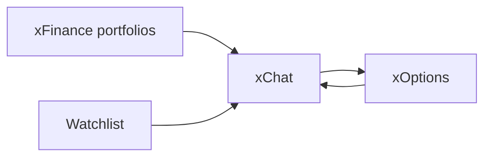

# xChat — product brief

**Platform:** xFinance · **Surface:** xChat · **Route:** `/xchat`

---

## Hook

Advisory chat **grounded in your real book** — Grok-powered desk workflows, portfolio and watchlist context, and compliance-forward access inside one workspace.

**Subline:** *Options Profits Powered by Grok*

---

## Who it is for

- Investment Advisors and HNWI desk operators who need **signal over generic chat**
- Professionals in **controlled early access** (admin-approved roles: viewer, operator, advisor)
- Teams that want **persona-governed** advisory (published personas, audit, plan limits) — not a public chatbot

---

## Jobs to be done

1. **Ask with book context** — holdings, watchlist, and active portfolio scope feed the model via governed tools and RAG (persona-linked collections only).
2. **Run desk-grade reports** — HNWI Desk Report v2.1 templates (concentration, wheel/CC scan, protective puts, watchlist pass, options desk snapshot) with structured Markdown output.
3. **Scan holdings and watchlist** — options action scans return sortable tables, confidence/urgency, export (PDF/CSV), and deep links into **xOptions**.
4. **Manage price alerts in plain language** — Premium+ natural-language rules tied to portfolio alerts and scanner jobs (plan-gated).
5. **Continue threads** — optional history in Mongo; depth presets (fast / expert / heavy) for reasoning tradeoffs.

---

## Differentiation

| vs point solution | xChat on xFinance |
| ----------------- | ----------------- |
| Generic Grok / ChatGPT | Personas, plan limits, tenant workspace caps, audit |
| Read-only portfolio dashboards | Same session as **xFinance (portfolios)** and **xOptions** — one rail, one book |
| Disconnected options research | Handoff to **xOptions** (prefilled composer, scenario attachments on Premium+) |

**Bundle story (platform):** execution-style portfolio tools + **Grok advisory** + options desk + exam prep (**xCoach**, roadmap) in one place — see [README](./README.md).

---

## Shipped capabilities (outcomes)

- Multi-turn advisory with **xAI Responses** tool-loop (portfolio, watchlist, market quote, strategy recommendations where enabled)
- **Persona picker** on the left rail (published + allowlisted for app users)
- **Templates** gallery and saved prompts; **Depth** presets for model routing
- **Desk Report v2.1** composer quick actions (five HNWI slugs)
- **Options action scan** rich cards + shareable report links
- **Vision paste** (PNG/JPEG) for statement and chart context
- **Voice mode** and dictation (see engineering doc)
- **Usage meter** — daily/hourly/minute caps per plan and tenant overrides
- Guest landing: access request + plans path; default signed-in landing remains `/xchat`

---

## How it connects

- **Requires a resolved portfolio** for sends when the product gates on book context (workspace rail picker).
- **xOptions → xChat:** review text and quant-trader results prefilled in composer (`sessionStorage` handoff).
- **xChat → xOptions:** scan rows and narrative CTAs open find-options with symbol context.

---

## Access & plans

- **Dark launch:** sign-in → access request → admin approval + role assignment
- **Limits:** xChat prompts per hour/day (UTC) on billing cards — source of truth: tenant `workspaceLimits` + `getPlanLimits()`; see [tenant-workspace-limits.md](../sre-ops/tenant-workspace-limits.md)
- **Shipped list pricing:** Basic / Premium / Premium+ on `/account/billing` (`src/lib/atx-billing-plans.ts`) — do not invent rates in external copy

---

## Guest funnel (marketing)

Public landing (`/`, `/for-developers`, `/growth`) follows the deep marketing shell only:

1. **Connect** — sign in / access request  
2. **Chat grounded in your book** — xChat after approval  
3. **Execute with guardrails** — xOptions + portfolio desk  

Hero: tagline chip + **aTx⚡Finance** lockup; primary CTA **Start Basic Trial — No Card**. Details: [ui-primitives-and-patterns.md](../design-system/ui-primitives-and-patterns.md) § Public / Guest Marketing · [intro-beta-circle.md](../branding/marketing/intro-beta-circle.md).

---

## Compliance

- Footer and thread disclaimers: **Not financial advice**
- For **approved professionals**; controlled access is part of the trust story
- Do not invent usage metrics, testimonials, or FINRA/SEC upload flows until productized

---

## Roadmap (honest)

| Theme | Track |
| ----- | ----- |
| xChat harden (metering, BFF parity, artifacts) | [PLAN.md § xChat harden](../PLAN.md#xchat-harden) **707** |
| Engine-grounded recommendations in tool loop | [PLAN.md § Engine × xAI](../PLAN.md#engine-xai-conversational-layer) |
| Tenant admin UI for `prompt_templates` | **709** |
| Plans landing driven from `getPlanLimits()` | Backlog in [current-state-features.md](../design-system/current-state-features.md) |

---

## Deep dives (engineering)

- [xchat-tools-guide.md](../xchat/xchat-tools-guide.md)
- [guides/xchat-personas.md](../guides/xchat-personas.md)
- [hnwi-options-prompts-v2.1.md](../xchat/hnwi-options-prompts-v2.1.md)
- [current-state-features.md](../design-system/current-state-features.md) § xChat workspace
