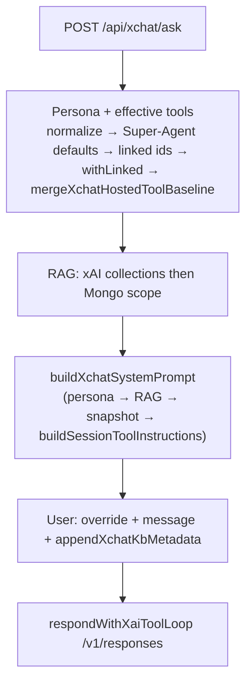

# xChat tools & prompt workflow

**Audience:** engineers and **xDesign Review** (`.cursor/skills/xdesign-review/SKILL.md`).

**Standard:** [xAI docs](https://docs.x.ai/overview) — [`xai-api-standard.md`](./xai-api-standard.md).

**Code map:** `ask/route.ts`, `xchat-prompt-build.ts`, `batch-prompt-context.ts`, `batch-service.ts`, `lib/xai.ts`, `lib/xai-tools.ts`, `tool-executor.ts`, `tool-definitions.ts`, `team-xai-collection-sync.ts`, `workspace-snapshot-for-prompt.ts`.

**UI (assistant bubbles):** `xchat-markdown-body.tsx` — `react-markdown` + `remark-gfm` + `rehype-sanitize`, Prism **oneDark** for fenced code, `preprocessXchatMarkdown` (`xchat-markdown-preprocess.ts`) for light cleanup before render.

---

## Flow (interactive ask)

- **Effective tools:** `mergeXchatHostedToolBaseline` keeps `web_search` + `x_search` on the wire even if Mongo omitted them.
- **Ask execution:** Always `respondWithXaiToolLoop` (not chat-completions). Batch stays **single-turn** xAI Batch JSONL — same **prompt** builders, different **transport**.

---

## Prompt assembly (locked)

| Layer | Builder | Notes |
|--------|---------|--------|
| System | `buildXchatSystemPrompt` | Order: persona text → RAG line or “No RAG…” → optional workspace snapshot (`atxfinance`) → `buildSessionToolInstructions` (hosted + custom copy from effective tools). |
| User | `appendXchatKbMetadata` | Same KB suffix for ask and batch: resolved collection ids + tool list. |
| Tools wire | `personaXapiToolsToXaiRequestTools` → `toXaiRequestTools(..., { forXaiResponsesApi: true })` | **`/v1/responses`** expects **flat** function tools (`type`, `name`, `parameters` at root). OpenAI-style nesting under `function` causes **422** and the request never runs hosted **web_search** / **x_search**. Chat Completions uses `toXaiRequestTools` without the flag (nested shape). |

**Model (ask):** persona `model`, else `XAI_CHAT_MODEL` or **`grok-4-1-fast-reasoning`** (`getDefaultPersonaChatModelId` in `ask/route.ts`); optional `reasoningEffort` for multi-agent ids only.

**Continuity mode (ask):**

- `XCHAT_USE_REMOTE_HISTORY=true` (preferred): use xAI hosted state via `store_messages` + `previous_response_id`.
- unset / `false`: no cross-turn continuity is injected.
- Mongo logs are still written for audit/debug/UI rails; they are not injected into ask prompts.

**Workspace portfolio scope (ask):** optional JSON **`portfolioId`** (24-char hex, user-owned) on `POST /api/xchat/ask` and optional **`/xchat?portfolioId=`** on the page load — both feed `workspacePortfolioId` into `loadWorkspaceSnapshotPreload` / `createXfinanceToolExecutor` so watchlist and positions match **`/watchlist?portfolioId=`**. Watchlist symbol JSON includes **`spotPriceDisplay`**, **`targetEntryNotional100xUsdDisplay`** (USD **`$…`** for the **100×** notional), legacy **`targetEntryNotional100xDisplay`** (plain digits), and desk **`targetEntryDisplay`** / **`entryPrice`**. The direct **“show my watchlist”** path formats **Spot** + **Target entry** in USD and skips added-at lines.

---

## Tool routing (ask)

| | |
|--|--|
| Path | `respondWithXaiToolLoop` + local executor when persona has `atxfinance` / `yahoo_finance`; stub for hosted-only. |
| Recovery | Synthetic / `previous_response_id` handling in `lib/xai.ts` — see [`xfeature-tools-plan.md`](./xfeature-tools-plan.md), [`atxfinance-tool-stub.md`](./atxfinance-tool-stub.md). |

**Marker → wire:** `atxfinance` / `yahoo_finance` → function schemas (flattened for Responses); `collections_search` → `file_search` + `vector_store_ids`; hosted types via `toXaiRequestTools`. Hosted tool **calls** are satisfied on xAI’s side; the loop acks `web_search` / `x_search` / `file_search` with `{}` (and defensively handles `collections_search` if emitted) in `lib/xai.ts`.

---

## Batch (`POST /api/xchat/batch`)

Jobs use the **persona from the database** (Admin → Personas); nothing is hardcoded server-side except the shared builders below. Transport: **[xAI Batch API](https://docs.x.ai/developers/advanced-api-usage/batch-api)** via `submitBatchJob` in `batch-service.ts`.

| | |
|--|--|
| System / user | Same as ask: `buildXchatSystemPrompt`, `appendXchatKbMetadata`, and the same effective-tool pipeline ending in `personaXapiToolsToXaiRequestTools` → `toXaiRequestTools`. |
| Execution | **Single-shot** JSONL per item — **no** local `respondWithXaiToolLoop`; provider-side tool chains are best-effort. |
| RAG | If `enableRag !== false` and `resolveXchatPersonaDeclaredCollectionIds` returns ids (persona `xaiCollection` / `teamCollection` / tool `collection_ids` only — no env team KB merge; max 2), pre-search feeds the RAG segment; `withLinkedCollectionTools(..., "replace")` matches ask (no merge of long persona tool `collection_ids`). |

**Modules:** `batch-service.ts`, `batch-prompt-context.ts`, `xchat-prompt-build.ts`.

---

## Multi-source orchestrator (Phase A)

`multi-source-context-orchestrator.ts` — parallel gather + optional synthesis; **not** wired to `POST /api/xchat/ask`. xAI collection search uses `resolveXchatPersonaDeclaredCollectionIds` (same cap as ask).

---

## Review checklist

- [ ] This file if prompt order or ask routing changes.
- [ ] OpenAPI overrides if `/api/*` contract changes.
- [ ] `npm run ci:gate` (and `npm run build` if deploy-sensitive).

## Related

[`xai-api-standard.md`](./xai-api-standard.md) · [`atxfinance-tool-stub.md`](./atxfinance-tool-stub.md) · [`xfeature-tools-plan.md`](./xfeature-tools-plan.md) · [`xchat-debug-logging.md`](./xchat-debug-logging.md)
