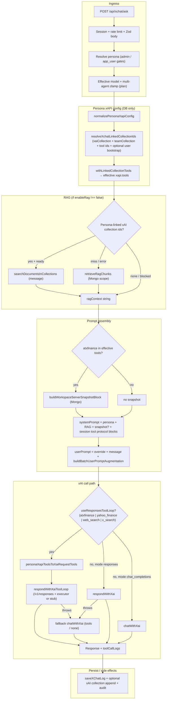
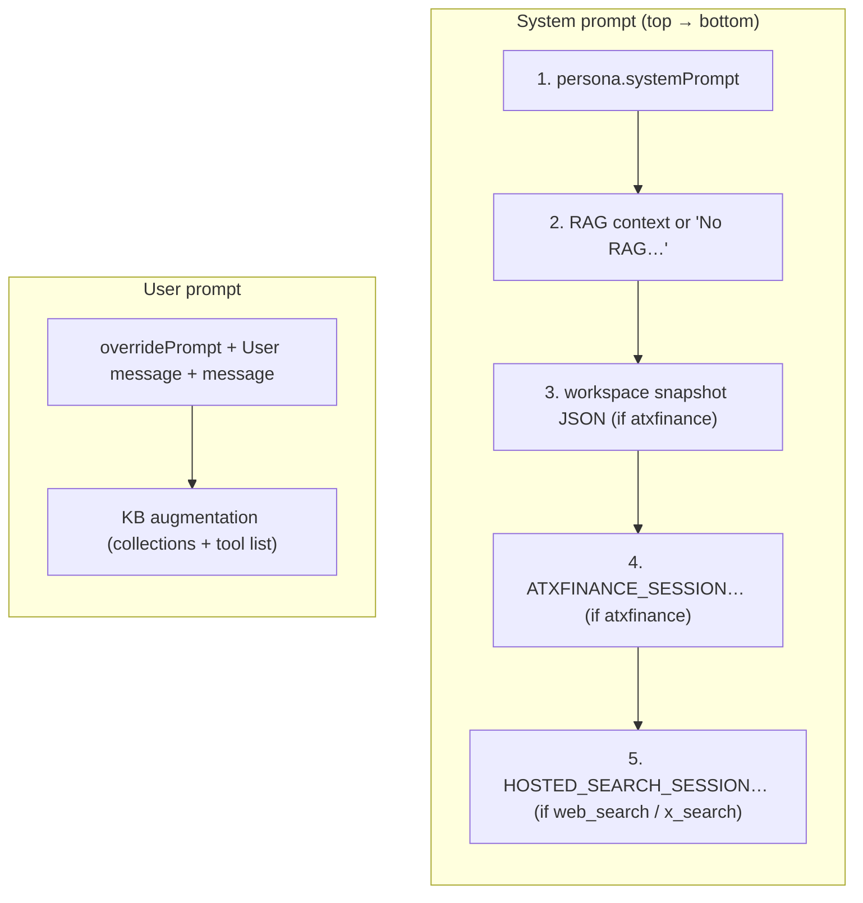

# xChat tools & prompt workflow (current state)

**Audience:** engineers and reviewers (including **xDesign Review** — `.cursor/skills/xdesign-review/SKILL.md`) validating persona, tool, and prompt behavior before merge or deploy.

**Integration standard:** [xAI documentation](https://docs.x.ai/overview) — see [`xai-api-standard.md`](./xai-api-standard.md).

**Primary code:** `src/app/api/xchat/ask/route.ts`, `src/lib/xai.ts`, `src/lib/xai-tools.ts`, `src/modules/xchat/tool-executor.ts`, `src/modules/xchat/workspace-snapshot-for-prompt.ts`, `src/modules/xchat/batch-prompt-context.ts`, `src/modules/xchat/batch-service.ts`.

---

## 1. End-to-end: `POST /api/xchat/ask`

High-level flow from authenticated request to model call and persistence.

---

## 2. System vs user prompt blocks (order matters)

What the model sees is built as **concatenated sections** (double-newline separated).

### System prompt (in order)

| # | Block | When | Source |
|---|--------|------|--------|
| 1 | Persona `systemPrompt` | Always | DB persona |
| 2 | RAG line | Always | Either snippet list from xAI collections, Mongo chunks, or `"No RAG context available."` |
| 3 | Workspace snapshot | If effective tools include `atxfinance` | `buildWorkspaceServerSnapshotBlock` — portfolio, accounts, watchlist, capped positions JSON |
| 4 | Session tool instructions (portfolio) | If `atxfinance` | `ATXFINANCE_SESSION_TOOL_INSTRUCTIONS` (`default-xpersonas.ts`) |
| 5 | Session tool instructions (hosted search) | If `web_search` and/or `x_search` | `HOSTED_SEARCH_SESSION_TOOL_INSTRUCTIONS` — native tool calls only; no pseudo markup in assistant text |

### User prompt (in order)

| # | Block | Source |
|---|--------|--------|
| 1 | `overridePrompt` + `User message:` + raw `message` | Persona + client (or message only if no override) |
| 2 | KB metadata | `buildBatchUserPromptAugmentation` — persona-linked collection id list (no env default), enumerated tool list (parity with batch) |

---

## 3. Tool routing after prompts are built (locked hotfix)

| Condition | xAI path | Custom tool execution |
|-----------|----------|------------------------|
| **All ask requests** | `respondWithXaiToolLoop` with `personaXapiToolsToXaiRequestTools` | **Local** `createXfinanceToolExecutor` when persona has `atxfinance` / `yahoo_finance`; otherwise a stub executor (hosted tools only). `web_search` / `x_search` **acked with `{}`**; **pseudo `<xai-tool>` / JSON markup recovery** runs in this single path. |

`xapi.mode` on persona is treated as metadata for now; runtime ask execution is locked to one Responses tool-loop path to prevent live-search drift from mixed execution branches.

**Synthetic recovery** (when the model prints tool-like text instead of real `function_call`): see `listSyntheticAtxfinanceToolArgs`, `<xai-tool>` web_search recovery, `previous_response_id` chaining — `src/lib/xai.ts`. Details: [`xfeature-tools-plan.md`](./xfeature-tools-plan.md), [`atxfinance-tool-stub.md`](./atxfinance-tool-stub.md).

---

## 3b. Model ↔ tool protocol (simplification + multi-agent lock)

**Goal:** minimize “format drift” (pseudo XML/JSON in assistant text) and keep one place for protocol copy.

| Practice | Why |
|----------|-----|
| **Fewer tools on the persona** | Each extra tool increases the chance the model mixes protocols; prefer the smallest set that answers the use case (e.g. RAG-only vs `web_search`-only vs `atxfinance` for live book). |
| **Server-injected protocol blocks** | `ATXFINANCE_SESSION_TOOL_INSTRUCTIONS` and `HOSTED_SEARCH_SESSION_TOOL_INSTRUCTIONS` in `default-xpersonas.ts` — persona `systemPrompt` should focus on *domain* tone, not repeating “don’t print `<xai-tool>`”. |
| **Route *all ask* traffic through `respondWithXaiToolLoop`** | Single place for `previous_response_id` + synthetic recovery when the model still prints markup (see §3). |
| **Batch stays different** | Batch items match persona tools but do **not** run `respondWithXaiToolLoop`; provider-side tool completion is best-effort. **Prompt parity:** `ATXFINANCE_SESSION_TOOL_INSTRUCTIONS` / `HOSTED_SEARCH_SESSION_TOOL_INSTRUCTIONS` and workspace snapshot (when `atxfinance`) are still appended in `submitBatchJob` — see [`batch-persona-contract.md`](./batch-persona-contract.md). |

**Recommended ask defaults (Mar 2026 hotfix):**

- Default/fallback model id: `grok-4.20-multi-agent-0309` (or `grok-4.20-multi-agent`).
- `reasoningEffort`: `medium` default; `high` / `xhigh` map to higher internal parallelism.
- Keep one prompt + one tool-loop workflow; avoid runtime branch splits that bypass drift recovery.

**Review checklist (xDesign-style):**

- **High — recovery path:** Any persona with `web_search` / `x_search` must hit `useResponsesToolLoop` so `xai.ts` recovery can run (not `respondWithXai` single-shot).
- **Medium — prompt drift:** Remove duplicate “use native tools only” paragraphs from individual personas after `HOSTED_SEARCH_SESSION_TOOL_INSTRUCTIONS` ships; keep one source of truth.
- **Low — model choice:** If a model still hallucinates tool markup after protocol + loop, try a different `persona.model` (A/B); that is orthogonal to API wiring.

---

## 4. Persona tool markers → wire format

Stored on persona as `xapi.tools[]` (`PersonaXapiToolDefinition`). Expanded for outbound xAI requests in `personaXapiToolsToXaiRequestTools` (`src/lib/xai-tools.ts`):

| Marker | Becomes |
|--------|---------|
| `atxfinance` | `function` tool `atxfinance` (schema in `tool-executor.ts`) |
| `yahoo_finance` | `function` tool `yahoo_finance` |
| `collections_search` | `file_search` + `vector_store_ids` (after merge with linked ids; stored persona tools still use `source.collection_ids`) |
| `web_search`, `x_search`, `file_search` | Passed through / normalized via `toXaiRequestTools` |

---

## 5. Internal multi-source orchestrator (Phase A)

**Module:** `src/modules/xchat/multi-source-context-orchestrator.ts` — **parallel data gather** (no per-branch LLM calls) plus optional **single** xAI **synthesis** via `respondWithXai` (`tool_choice: none`, empty tools).

| Branch | Runs when (persona allowlist) |
|--------|-------------------------------|
| Workspace snapshot | `xapi.tools` includes `atxfinance` → `buildWorkspaceServerSnapshotBlock` |
| xAI collection snippets | `enableRag !== false`, persona-linked collection ids, scope **not** blocked by `getScopeReadinessSummary` → `searchDocumentsInCollections` |
| Mongo scope RAG | `enableRag !== false` → `retrieveRagChunks` (runs **in parallel** with xAI search; both may appear in the bundle) |
| Yahoo quotes | `yahoo_finance` **or** `atxfinance` on persona → `getYahooMarketQuote` for tickers from `extractTickerCandidates(message)` (default cap **6**) |

**Exports:** `gatherMultiSourceWorkspaceContext`, `formatGatheredContextForPrompt`, `synthesizeFromMultiSourceContext`, `runMultiSourceWorkspaceSynthesis`. **Not** wired to `POST /api/xchat/ask` in Phase A — add HTTP route, scheduler job, and trace persistence in follow-ups.

**Tests:** `tests/unit/multi-source-context-orchestrator.test.ts`.

---

## 6. Batch (`POST /api/xchat/batch`) — contrast

| Aspect | Interactive ask | Batch item |
|--------|-----------------|------------|
| Prompt KB block | Same `buildBatchUserPromptAugmentation` on user text | Same |
| Workspace snapshot | If persona has `atxfinance` | Same (`buildWorkspaceServerSnapshotBlock` per submitter session) |
| Tools on wire | Local loop when custom tools present | `personaXapiToolsToXaiRequestTools` in JSONL body |
| Multi-turn local executor | Yes (`respondWithXaiToolLoop`) | **No** — single xAI Batch request per item; provider may or may not run full tool chains |

Contract: [`batch-persona-contract.md`](./batch-persona-contract.md).

---

## 7. xDesign Review checklist (doc parity)

When changing prompts, tools, or xAI routing, reviewers should confirm:

- [ ] This guide (or linked contracts) updated if **assembly order**, **new blocks**, or **routing branches** change.
- [ ] [`xai-api-standard.md`](./xai-api-standard.md) / OpenAPI overrides if **client-visible** semantics change (`src/lib/openapi/current-state-overrides.ts`).
- [ ] Tests: `tests/integration/xchat-ask-route.test.ts`, `tests/integration/xai-tool-loop.test.ts`, `tests/unit/xai-tools.test.ts`, `tests/unit/workspace-snapshot-for-prompt.test.ts`, `tests/unit/multi-source-context-orchestrator.test.ts` as applicable.
- [ ] `npm run ci:gate` (+ `npm run build` for release-sensitive PRs per `AGENTS.md`).

---

## 8. Related documents

| Doc | Focus |
|-----|--------|
| [`xai-api-standard.md`](./xai-api-standard.md) | xAI docs as source of truth + repo file map |
| [`atxfinance-tool-stub.md`](./atxfinance-tool-stub.md) | `atxfinance` operations, security, executor |
| [`batch-persona-contract.md`](./batch-persona-contract.md) | Batch prompt/tool/RAG contract |
| [`xfeature-tools-plan.md`](./xfeature-tools-plan.md) | Historical plan + upstream links |
| [`xchat-debug-logging.md`](./xchat-debug-logging.md) | `ENABLE_XCHAT_DEBUG` taxonomy |
